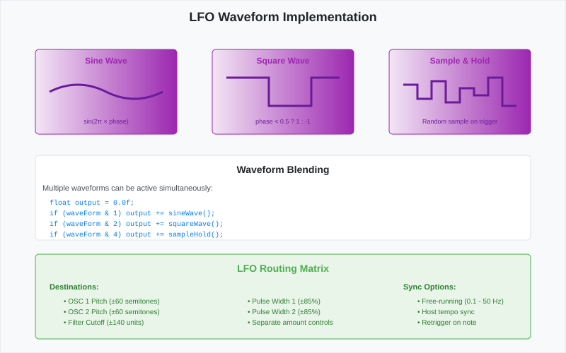
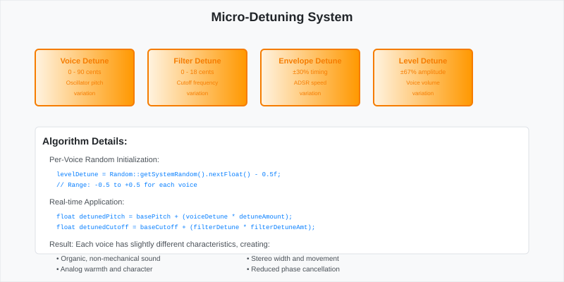
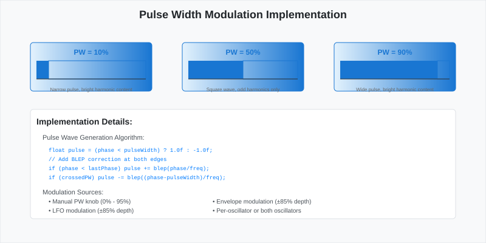
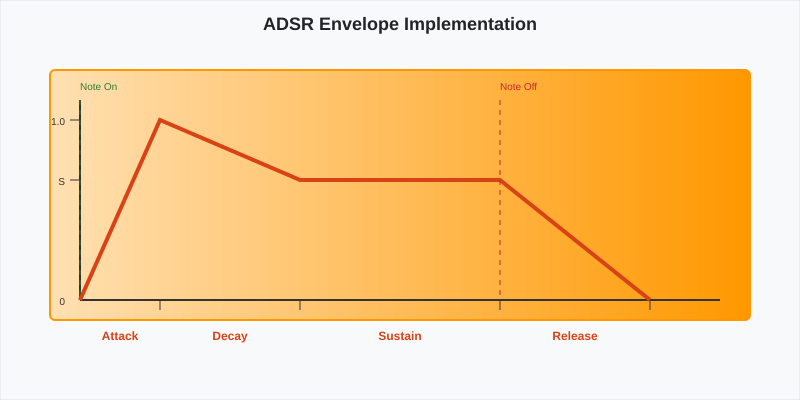

# DSP Implementation Documentation

This document pr

*LFO waveform types showing sine, triangle, sawtooth, and sample & hold patterns used for modulation.*ate Variable Filter](diagrams/state-variable-filter.svg)

*State variable filter topology showing lowpass, highpass, and bandpass outputs with resonance feedback.*ides an in-depth analysis of the d

*Micro-detuning system for creating ensemble effects by slightly detuning voices against each other.*ital signal processing algorithms implemented in OB-Xd, co

*Pulse width modulation diagram showing how the pulse width parameter affects the waveform duty cycle and harmonic content.*ring oscillators, filters, envelopes, and modulation systems.

## Synthesis Architecture Overview

OB-Xd implements a subtractive synthesis architecture based on the classic Oberheim OB-X, featuring:

- **Dual oscillator design** with analog-modeled waveforms
- **State Variable Filter** with multimode operation
- **Dual ADSR envelopes** with exponential curves
- **Global LFO system** with multiple routing destinations
- **Micro-detuning algorithms** for analog warmth

## Oscillator Implementation

### Bandlimited Oscillators

The synthesizer uses BLEP (Bandlimited Step) synthesis to prevent aliasing:

```cpp
// SawOsc.h - Bandlimited sawtooth implementation
class SawOsc
{
private:
    float phase;
    float freq;
    BlepData blepData;
    
public:
    inline float ProcessSample()
    {
        float sample = phase * 2.0f - 1.0f; // Naive sawtooth
        
        // Add BLEP correction at discontinuity
        if (phase < lastPhase) // Wrapped around
        {
            float fraction = phase / (phase + 1.0f - lastPhase);
            sample += blepData.getBlep(fraction);
        }
        
        lastPhase = phase;
        phase += freq * sampleRateInv;
        if (phase >= 1.0f) phase -= 1.0f;
        
        return sample;
    }
};
```

### Pulse Width Modulation

```svg
<svg width="800" height="400" xmlns="http://www.w3.org/2000/svg">
  <defs>
    <linearGradient id="pwGradient" x1="0%" y1="0%" x2="100%" y2="0%">
      <stop offset="0%" style="stop-color:#e3f2fd;stop-opacity:1" />
      <stop offset="100%" style="stop-color:#1976d2;stop-opacity:1" />
    </linearGradient>
  </defs>
  
  <!-- Background -->
  <rect width="800" height="400" fill="#f8f9fa" stroke="#dee2e6" stroke-width="1"/>
  
  <!-- Title -->
  <text x="400" y="30" font-family="Arial, sans-serif" font-size="18" font-weight="bold" text-anchor="middle" fill="#212529">Pulse Width Modulation Implementation</text>
  
  <!-- PW = 10% -->
  <rect x="50" y="70" width="200" height="80" fill="url(#pwGradient)" stroke="#1976d2" stroke-width="1" rx="5"/>
  <text x="150" y="90" font-family="Arial, sans-serif" font-size="12" font-weight="bold" text-anchor="middle" fill="#1976d2">PW = 10%</text>
  
  <!-- Waveform -->
  <rect x="60" y="100" width="20" height="30" fill="#1976d2"/>
  <rect x="80" y="100" width="160" height="30" fill="none" stroke="#1976d2" stroke-width="1"/>
  <line x1="60" y1="130" x2="240" y2="130" stroke="#333" stroke-width="1"/>
  <text x="150" y="150" font-family="Arial, sans-serif" font-size="8" text-anchor="middle" fill="#666">Narrow pulse, bright harmonic content</text>
  
  <!-- PW = 50% -->
  <rect x="300" y="70" width="200" height="80" fill="url(#pwGradient)" stroke="#1976d2" stroke-width="1" rx="5"/>
  <text x="400" y="90" font-family="Arial, sans-serif" font-size="12" font-weight="bold" text-anchor="middle" fill="#1976d2">PW = 50%</text>
  
  <!-- Waveform -->
  <rect x="310" y="100" width="90" height="30" fill="#1976d2"/>
  <rect x="400" y="100" width="90" height="30" fill="none" stroke="#1976d2" stroke-width="1"/>
  <line x1="310" y1="130" x2="490" y2="130" stroke="#333" stroke-width="1"/>
  <text x="400" y="150" font-family="Arial, sans-serif" font-size="8" text-anchor="middle" fill="#666">Square wave, odd harmonics only</text>
  
  <!-- PW = 90% -->
  <rect x="550" y="70" width="200" height="80" fill="url(#pwGradient)" stroke="#1976d2" stroke-width="1" rx="5"/>
  <text x="650" y="90" font-family="Arial, sans-serif" font-size="12" font-weight="bold" text-anchor="middle" fill="#1976d2">PW = 90%</text>
  
  <!-- Waveform -->
  <rect x="560" y="100" width="160" height="30" fill="#1976d2"/>
  <rect x="720" y="100" width="20" height="30" fill="none" stroke="#1976d2" stroke-width="1"/>
  <line x1="560" y1="130" x2="740" y2="130" stroke="#333" stroke-width="1"/>
  <text x="650" y="150" font-family="Arial, sans-serif" font-size="8" text-anchor="middle" fill="#666">Wide pulse, bright harmonic content</text>
  
  <!-- Implementation details -->
  <rect x="50" y="180" width="700" height="180" fill="#ffffff" stroke="#dee2e6" stroke-width="1" rx="5"/>
  <text x="60" y="205" font-family="Arial, sans-serif" font-size="14" font-weight="bold" fill="#212529">Implementation Details:</text>
  
  <text x="70" y="230" font-family="Arial, sans-serif" font-size="11" fill="#495057">Pulse Wave Generation Algorithm:</text>
  <text x="80" y="250" font-family="Courier New, monospace" font-size="9" fill="#007bff">float pulse = (phase &lt; pulseWidth) ? 1.0f : -1.0f;</text>
  <text x="80" y="265" font-family="Courier New, monospace" font-size="9" fill="#007bff">// Add BLEP correction at both edges</text>
  <text x="80" y="280" font-family="Courier New, monospace" font-size="9" fill="#007bff">if (phase &lt; lastPhase) pulse += blep(phase/freq);</text>
  <text x="80" y="295" font-family="Courier New, monospace" font-size="9" fill="#007bff">if (crossedPW) pulse -= blep((phase-pulseWidth)/freq);</text>
  
  <text x="70" y="320" font-family="Arial, sans-serif" font-size="11" fill="#495057">Modulation Sources:</text>
  <text x="80" y="335" font-family="Arial, sans-serif" font-size="10" fill="#495057">• Manual PW knob (0% - 95%)</text>
  <text x="80" y="350" font-family="Arial, sans-serif" font-size="10" fill="#495057">• LFO modulation (±85% depth)</text>
  <text x="350" y="335" font-family="Arial, sans-serif" font-size="10" fill="#495057">• Envelope modulation (±85% depth)</text>
  <text x="350" y="350" font-family="Arial, sans-serif" font-size="10" fill="#495057">• Per-oscillator or both oscillators</text>
</svg>
```

### Hard Sync Implementation

```cpp
// ObxdOscillatorB.h - Hard sync between oscillators
class ObxdOscillatorB
{
public:
    float ProcessSample()
    {
        float osc1Sample = osc1.ProcessSample();
        
        if (hardSync && osc1.hasReset())
        {
            osc2.reset(); // Force OSC2 to restart its cycle
        }
        
        float osc2Sample = osc2.ProcessSample();
        
        // Cross modulation: OSC1 frequency modulates OSC2
        if (xmod > 0.0f)
        {
            osc2.setFreqMod(osc1Sample * xmod);
        }
        
        return (osc1Sample * o1mx) + (osc2Sample * o2mx) + (noise * nmx);
    }
};
```

## Filter Implementation

### State Variable Filter Design

OB-Xd implements a state variable filter (SVF) that can morphs between filter types:



*ADSR envelope generator showing the four phases (Attack, Decay, Sustain, Release) and their time-based progression.*
  <defs>
    <marker id="arrow" markerWidth="10" markerHeight="7" refX="10" refY="3.5" orient="auto">
      <polygon points="0 0, 10 3.5, 0 7" fill="#333"/>
    </marker>
  </defs>
  
  <!-- Background -->
  <rect width="900" height="500" fill="#f8f9fa" stroke="#dee2e6" stroke-width="1"/>
  
  <!-- Title -->
  <text x="450" y="30" font-family="Arial, sans-serif" font-size="18" font-weight="bold" text-anchor="middle" fill="#212529">State Variable Filter Architecture</text>
  
  <!-- Input -->
  <circle cx="100" cy="150" r="20" fill="#ffcdd2" stroke="#d32f2f" stroke-width="2"/>
  <text x="100" y="155" font-family="Arial, sans-serif" font-size="10" text-anchor="middle" fill="#d32f2f">Input</text>
  
  <!-- Feedback -->
  <rect x="180" y="120" width="60" height="30" fill="#fff3e0" stroke="#ff9800" stroke-width="2" rx="5"/>
  <text x="210" y="135" font-family="Arial, sans-serif" font-size="9" text-anchor="middle" fill="#ff9800">FB</text>
  <text x="210" y="145" font-family="Arial, sans-serif" font-size="7" text-anchor="middle" fill="#ff9800">Resonance</text>
  
  <!-- First Integrator -->
  <rect x="300" y="120" width="60" height="60" fill="#e8f5e8" stroke="#4caf50" stroke-width="2" rx="5"/>
  <text x="330" y="140" font-family="Arial, sans-serif" font-size="10" text-anchor="middle" fill="#4caf50">∫</text>
  <text x="330" y="155" font-family="Arial, sans-serif" font-size="8" text-anchor="middle" fill="#4caf50">Integrator 1</text>
  <text x="330" y="170" font-family="Arial, sans-serif" font-size="7" text-anchor="middle" fill="#4caf50">Bandpass</text>
  
  <!-- Second Integrator -->
  <rect x="420" y="120" width="60" height="60" fill="#e8f5e8" stroke="#4caf50" stroke-width="2" rx="5"/>
  <text x="450" y="140" font-family="Arial, sans-serif" font-size="10" text-anchor="middle" fill="#4caf50">∫</text>
  <text x="450" y="155" font-family="Arial, sans-serif" font-size="8" text-anchor="middle" fill="#4caf50">Integrator 2</text>
  <text x="450" y="170" font-family="Arial, sans-serif" font-size="7" text-anchor="middle" fill="#4caf50">Lowpass</text>
  
  <!-- Highpass output -->
  <circle cx="250" cy="80" r="15" fill="#e3f2fd" stroke="#1976d2" stroke-width="1"/>
  <text x="250" y="85" font-family="Arial, sans-serif" font-size="8" text-anchor="middle" fill="#1976d2">HP</text>
  
  <!-- Bandpass output -->
  <circle cx="330" cy="220" r="15" fill="#fff3e0" stroke="#ff9800" stroke-width="1"/>
  <text x="330" y="225" font-family="Arial, sans-serif" font-size="8" text-anchor="middle" fill="#ff9800">BP</text>
  
  <!-- Lowpass output -->
  <circle cx="450" cy="220" r="15" fill="#ffebee" stroke="#f44336" stroke-width="1"/>
  <text x="450" y="225" font-family="Arial, sans-serif" font-size="8" text-anchor="middle" fill="#f44336">LP</text>
  
  <!-- Multimode mixer -->
  <rect x="550" y="140" width="80" height="40" fill="#f3e5f5" stroke="#7b1fa2" stroke-width="2" rx="5"/>
  <text x="590" y="155" font-family="Arial, sans-serif" font-size="10" text-anchor="middle" fill="#7b1fa2">MIXER</text>
  <text x="590" y="170" font-family="Arial, sans-serif" font-size="8" text-anchor="middle" fill="#7b1fa2">Multimode</text>
  
  <!-- Output -->
  <circle cx="700" cy="160" r="20" fill="#e8f5e8" stroke="#4caf50" stroke-width="2"/>
  <text x="700" y="165" font-family="Arial, sans-serif" font-size="10" text-anchor="middle" fill="#4caf50">Output</text>
  
  <!-- Signal flow arrows -->
  <line x1="120" y1="150" x2="180" y2="135" stroke="#333" stroke-width="2" marker-end="url(#arrow)"/>
  <line x1="240" y1="135" x2="300" y2="150" stroke="#333" stroke-width="2" marker-end="url(#arrow)"/>
  <line x1="360" y1="150" x2="420" y2="150" stroke="#333" stroke-width="2" marker-end="url(#arrow)"/>
  
  <!-- Output taps -->
  <line x1="210" y1="120" x2="250" y2="95" stroke="#1976d2" stroke-width="1" marker-end="url(#arrow)"/>
  <line x1="330" y1="180" x2="330" y2="205" stroke="#ff9800" stroke-width="1" marker-end="url(#arrow)"/>
  <line x1="450" y1="180" x2="450" y2="205" stroke="#f44336" stroke-width="1" marker-end="url(#arrow)"/>
  
  <!-- To mixer -->
  <line x1="250" y1="95" x2="550" y2="150" stroke="#1976d2" stroke-width="1" stroke-dasharray="3,3" marker-end="url(#arrow)"/>
  <line x1="330" y1="205" x2="550" y2="165" stroke="#ff9800" stroke-width="1" stroke-dasharray="3,3" marker-end="url(#arrow)"/>
  <line x1="450" y1="205" x2="550" y2="170" stroke="#f44336" stroke-width="1" stroke-dasharray="3,3" marker-end="url(#arrow)"/>
  
  <!-- Final output -->
  <line x1="630" y1="160" x2="680" y2="160" stroke="#333" stroke-width="3" marker-end="url(#arrow)"/>
  
  <!-- Feedback loop -->
  <path d="M 450,200 Q 520,250 280,250 Q 150,250 150,180 Q 150,135 180,135" 
        fill="none" stroke="#ff9800" stroke-width="1" stroke-dasharray="5,5" marker-end="url(#arrow)"/>
  
  <!-- Implementation details -->
  <rect x="50" y="290" width="800" height="180" fill="#ffffff" stroke="#dee2e6" stroke-width="1" rx="5"/>
  <text x="60" y="315" font-family="Arial, sans-serif" font-size="14" font-weight="bold" fill="#212529">Filter Implementation Details:</text>
  
  <text x="70" y="340" font-family="Arial, sans-serif" font-size="11" font-weight="bold" fill="#495057">12dB Mode (Single SVF):</text>
  <text x="80" y="355" font-family="Courier New, monospace" font-size="9" fill="#007bff">hp = input - resonance * bp - lp;</text>
  <text x="80" y="370" font-family="Courier New, monospace" font-size="9" fill="#007bff">bp += frequency * hp;</text>
  <text x="80" y="385" font-family="Courier New, monospace" font-size="9" fill="#007bff">lp += frequency * bp;</text>
  
  <text x="450" y="340" font-family="Arial, sans-serif" font-size="11" font-weight="bold" fill="#495057">24dB Mode (Cascade):</text>
  <text x="460" y="355" font-family="Courier New, monospace" font-size="9" fill="#007bff">stage1 = svf1.process(input);</text>
  <text x="460" y="370" font-family="Courier New, monospace" font-size="9" fill="#007bff">output = svf2.process(stage1);</text>
  <text x="460" y="385" font-family="Courier New, monospace" font-size="9" fill="#007bff">// 4-pole response</text>
  
  <text x="70" y="410" font-family="Arial, sans-serif" font-size="11" fill="#495057">Multimode Blending:</text>
  <text x="80" y="425" font-family="Arial, sans-serif" font-size="10" fill="#495057">• Continuous morphing between HP → Notch → BP → LP</text>
  <text x="80" y="440" font-family="Arial, sans-serif" font-size="10" fill="#495057">• 12dB: Linear blend between filter types</text>
  <text x="80" y="455" font-family="Arial, sans-serif" font-size="10" fill="#495057">• 24dB: 4-pole to 1-pole morphing for unique character</text>
</svg>
```

### Filter Frequency Response

The filter cutoff frequency is calculated using exponential mapping:

```cpp
// Filter.h - Cutoff frequency calculation
float Filter::setCutoff(float cutoffParam)
{
    // Convert 0-120 parameter to Hz with exponential scaling
    float cutoffHz = getPitch(cutoffParam - 45.0f);
    
    // Limit to prevent numerical instability
    cutoffHz = jmin(cutoffHz, sampleRate * 0.5f - 120.0f);
    
    // Convert to filter coefficient
    frequency = tan(cutoffHz * PI * sampleRateInv);
    
    return cutoffHz;
}
```

## Envelope Implementation

### ADSR Envelope Curves

```svg
<svg width="800" height="400" xmlns="http://www.w3.org/2000/svg">
  <defs>
    <linearGradient id="envGradient" x1="0%" y1="0%" x2="100%" y2="0%">
      <stop offset="0%" style="stop-color:#ffe0b2;stop-opacity:1" />
      <stop offset="100%" style="stop-color:#ff9800;stop-opacity:1" />
    </linearGradient>
  </defs>
  
  <!-- Background -->
  <rect width="800" height="400" fill="#f8f9fa" stroke="#dee2e6" stroke-width="1"/>
  
  <!-- Title -->
  <text x="400" y="30" font-family="Arial, sans-serif" font-size="18" font-weight="bold" text-anchor="middle" fill="#212529">ADSR Envelope Implementation</text>
  
  <!-- Envelope curve -->
  <rect x="50" y="70" width="700" height="250" fill="url(#envGradient)" stroke="#ff9800" stroke-width="2" rx="5"/>
  
  <!-- Axes -->
  <line x1="80" y1="300" x2="720" y2="300" stroke="#333" stroke-width="2"/>
  <line x1="80" y1="300" x2="80" y2="100" stroke="#333" stroke-width="2"/>
  
  <!-- Envelope curve -->
  <path d="M 80,300 L 160,120 L 300,180 L 500,180 L 650,300" 
        fill="none" stroke="#d84315" stroke-width="4"/>
  
  <!-- Phase labels -->
  <text x="120" y="340" font-family="Arial, sans-serif" font-size="12" font-weight="bold" text-anchor="middle" fill="#d84315">Attack</text>
  <text x="230" y="340" font-family="Arial, sans-serif" font-size="12" font-weight="bold" text-anchor="middle" fill="#d84315">Decay</text>
  <text x="400" y="340" font-family="Arial, sans-serif" font-size="12" font-weight="bold" text-anchor="middle" fill="#d84315">Sustain</text>
  <text x="575" y="340" font-family="Arial, sans-serif" font-size="12" font-weight="bold" text-anchor="middle" fill="#d84315">Release</text>
  
  <!-- Time markers -->
  <line x1="160" y1="300" x2="160" y2="310" stroke="#333" stroke-width="1"/>
  <line x1="300" y1="300" x2="300" y2="310" stroke="#333" stroke-width="1"/>
  <line x1="500" y1="300" x2="500" y2="310" stroke="#333" stroke-width="1"/>
  <line x1="650" y1="300" x2="650" y2="310" stroke="#333" stroke-width="1"/>
  
  <!-- Level markers -->
  <line x1="70" y1="120" x2="80" y2="120" stroke="#333" stroke-width="1"/>
  <line x1="70" y1="180" x2="80" y2="180" stroke="#333" stroke-width="1"/>
  <text x="65" y="125" font-family="Arial, sans-serif" font-size="10" text-anchor="end" fill="#333">1.0</text>
  <text x="65" y="185" font-family="Arial, sans-serif" font-size="10" text-anchor="end" fill="#333">S</text>
  <text x="65" y="305" font-family="Arial, sans-serif" font-size="10" text-anchor="end" fill="#333">0</text>
  
  <!-- Note events -->
  <text x="80" y="90" font-family="Arial, sans-serif" font-size="10" fill="#2e7d32">Note On</text>
  <text x="500" y="90" font-family="Arial, sans-serif" font-size="10" fill="#c62828">Note Off</text>
  
  <!-- Vertical lines for note events -->
  <line x1="80" y1="100" x2="80" y2="300" stroke="#2e7d32" stroke-width="1" stroke-dasharray="5,5"/>
  <line x1="500" y1="100" x2="500" y2="300" stroke="#c62828" stroke-width="1" stroke-dasharray="5,5"/>
</svg>
```

### Envelope State Machine

```cpp
// AdsrEnvelope.h - Envelope implementation with exponential curves
class AdsrEnvelope
{
private:
    enum EnvelopeState { ENV_IDLE, ENV_ATTACK, ENV_DECAY, ENV_SUSTAIN, ENV_RELEASE };
    
    EnvelopeState state;
    float currentLevel;
    float targetLevel;
    float increment;
    
public:
    float processSample()
    {
        switch (state)
        {
            case ENV_ATTACK:
                currentLevel += increment;
                if (currentLevel >= 1.0f)
                {
                    currentLevel = 1.0f;
                    state = ENV_DECAY;
                    setTargetLevel(sustainLevel);
                }
                break;
                
            case ENV_DECAY:
                currentLevel += increment; // Negative increment
                if (currentLevel <= sustainLevel)
                {
                    currentLevel = sustainLevel;
                    state = ENV_SUSTAIN;
                }
                break;
                
            case ENV_SUSTAIN:
                // Hold at sustain level
                break;
                
            case ENV_RELEASE:
                currentLevel += increment; // Negative increment
                if (currentLevel <= 0.0f)
                {
                    currentLevel = 0.0f;
                    state = ENV_IDLE;
                }
                break;
        }
        
        return currentLevel;
    }
    
private:
    void setTargetLevel(float target)
    {
        // Exponential curve calculation
        float timeSamples = getCurrentPhaseTime() * sampleRate;
        increment = (target - currentLevel) / timeSamples;
    }
};
```

## LFO Implementation

### Multi-waveform LFO

```svg
<svg width="800" height="500" xmlns="http://www.w3.org/2000/svg">
  <defs>
    <linearGradient id="lfoGradient" x1="0%" y1="0%" x2="100%" y2="0%">
      <stop offset="0%" style="stop-color:#f3e5f5;stop-opacity:1" />
      <stop offset="100%" style="stop-color:#9c27b0;stop-opacity:1" />
    </linearGradient>
  </defs>
  
  <!-- Background -->
  <rect width="800" height="500" fill="#f8f9fa" stroke="#dee2e6" stroke-width="1"/>
  
  <!-- Title -->
  <text x="400" y="30" font-family="Arial, sans-serif" font-size="18" font-weight="bold" text-anchor="middle" fill="#212529">LFO Waveform Implementation</text>
  
  <!-- Sine Wave -->
  <rect x="50" y="70" width="200" height="120" fill="url(#lfoGradient)" stroke="#9c27b0" stroke-width="1" rx="5"/>
  <text x="150" y="90" font-family="Arial, sans-serif" font-size="12" font-weight="bold" text-anchor="middle" fill="#9c27b0">Sine Wave</text>
  
  <!-- Sine curve -->
  <path d="M 70,130 Q 110,110 150,130 Q 190,150 230,130" 
        fill="none" stroke="#6a1b9a" stroke-width="3"/>
  <text x="150" y="175" font-family="Arial, sans-serif" font-size="9" text-anchor="middle" fill="#6a1b9a">sin(2π × phase)</text>
  
  <!-- Square Wave -->
  <rect x="300" y="70" width="200" height="120" fill="url(#lfoGradient)" stroke="#9c27b0" stroke-width="1" rx="5"/>
  <text x="400" y="90" font-family="Arial, sans-serif" font-size="12" font-weight="bold" text-anchor="middle" fill="#9c27b0">Square Wave</text>
  
  <!-- Square curve -->
  <path d="M 320,110 L 380,110 L 380,150 L 440,150 L 440,110 L 480,110" 
        fill="none" stroke="#6a1b9a" stroke-width="3"/>
  <text x="400" y="175" font-family="Arial, sans-serif" font-size="9" text-anchor="middle" fill="#6a1b9a">phase &lt; 0.5 ? 1 : -1</text>
  
  <!-- Sample & Hold -->
  <rect x="550" y="70" width="200" height="120" fill="url(#lfoGradient)" stroke="#9c27b0" stroke-width="1" rx="5"/>
  <text x="650" y="90" font-family="Arial, sans-serif" font-size="12" font-weight="bold" text-anchor="middle" fill="#9c27b0">Sample &amp; Hold</text>
  
  <!-- S&H curve -->
  <path d="M 570,120 L 590,120 L 590,140 L 610,140 L 610,115 L 630,115 L 630,145 L 650,145 L 650,125 L 670,125 L 670,135 L 690,135 L 690,110 L 710,110 L 710,150 L 730,150" 
        fill="none" stroke="#6a1b9a" stroke-width="3"/>
  <text x="650" y="175" font-family="Arial, sans-serif" font-size="9" text-anchor="middle" fill="#6a1b9a">Random sample on trigger</text>
  
  <!-- Blended waveforms -->
  <rect x="50" y="220" width="700" height="120" fill="#ffffff" stroke="#dee2e6" stroke-width="1" rx="5"/>
  <text x="400" y="245" font-family="Arial, sans-serif" font-size="14" font-weight="bold" text-anchor="middle" fill="#212529">Waveform Blending</text>
  <text x="60" y="270" font-family="Arial, sans-serif" font-size="11" fill="#495057">Multiple waveforms can be active simultaneously:</text>
  <text x="70" y="290" font-family="Courier New, monospace" font-size="10" fill="#007bff">float output = 0.0f;</text>
  <text x="70" y="305" font-family="Courier New, monospace" font-size="10" fill="#007bff">if (waveForm &amp; 1) output += sineWave();</text>
  <text x="70" y="320" font-family="Courier New, monospace" font-size="10" fill="#007bff">if (waveForm &amp; 2) output += squareWave();</text>
  <text x="70" y="335" font-family="Courier New, monospace" font-size="10" fill="#007bff">if (waveForm &amp; 4) output += sampleHold();</text>
  
  <!-- Routing matrix -->
  <rect x="50" y="360" width="700" height="120" fill="#e8f5e8" stroke="#4caf50" stroke-width="1" rx="5"/>
  <text x="400" y="385" font-family="Arial, sans-serif" font-size="14" font-weight="bold" text-anchor="middle" fill="#4caf50">LFO Routing Matrix</text>
  
  <!-- Destinations -->
  <text x="70" y="410" font-family="Arial, sans-serif" font-size="11" font-weight="bold" fill="#2e7d32">Destinations:</text>
  <text x="90" y="430" font-family="Arial, sans-serif" font-size="10" fill="#2e7d32">• OSC 1 Pitch (±60 semitones)</text>
  <text x="90" y="445" font-family="Arial, sans-serif" font-size="10" fill="#2e7d32">• OSC 2 Pitch (±60 semitones)</text>
  <text x="90" y="460" font-family="Arial, sans-serif" font-size="10" fill="#2e7d32">• Filter Cutoff (±140 units)</text>
  
  <text x="350" y="430" font-family="Arial, sans-serif" font-size="10" fill="#2e7d32">• Pulse Width 1 (±85%)</text>
  <text x="350" y="445" font-family="Arial, sans-serif" font-size="10" fill="#2e7d32">• Pulse Width 2 (±85%)</text>
  <text x="350" y="460" font-family="Arial, sans-serif" font-size="10" fill="#2e7d32">• Separate amount controls</text>
  
  <text x="570" y="410" font-family="Arial, sans-serif" font-size="11" font-weight="bold" fill="#2e7d32">Sync Options:</text>
  <text x="590" y="430" font-family="Arial, sans-serif" font-size="10" fill="#2e7d32">• Free-running (0.1 - 50 Hz)</text>
  <text x="590" y="445" font-family="Arial, sans-serif" font-size="10" fill="#2e7d32">• Host tempo sync</text>
  <text x="590" y="460" font-family="Arial, sans-serif" font-size="10" fill="#2e7d32">• Retrigger on note</text>
</svg>
```

## Micro-Detuning Algorithm

One of OB-Xd's key features is its micro-detuning system that recreates analog warmth:

```cpp
// ObxdVoice.h - Micro-detuning implementation
class ObxdVoice
{
private:
    // Random detuning amounts per voice (initialized once)
    float levelDetune;     // ±0.5 range
    float EnvDetune;       // ±0.5 range  
    float FenvDetune;      // ±0.5 range
    float FltDetune;       // ±0.5 range
    float PortaDetune;     // ±0.5 range
    
public:
    ObxdVoice()
    {
        // Initialize random detuning per voice
        levelDetune = Random::getSystemRandom().nextFloat() - 0.5f;
        EnvDetune = Random::getSystemRandom().nextFloat() - 0.5f;
        FenvDetune = Random::getSystemRandom().nextFloat() - 0.5f;
        FltDetune = Random::getSystemRandom().nextFloat() - 0.5f;
        PortaDetune = Random::getSystemRandom().nextFloat() - 0.5f;
    }
    
    float ProcessSample()
    {
        // Apply micro-detuning to various parameters
        float oscOutput = osc.ProcessSample() * (1 - levelDetuneAmt * levelDetune);
        
        float cutoffCalc = getPitch(
            cutoff + 
            FltDetune * FltDetAmt +      // Filter frequency detune
            fenvamt * fenvd.feedReturn(envm)
        );
        
        // Envelope timing variations
        env.setUniqueDerivance(1 + EnvDetune * envDetuneAmt);
        fenv.setUniqueDerivance(1 + FenvDetune * envDetuneAmt);
        
        return processedSample;
    }
};
```

### Detuning Types and Ranges

```svg
<svg width="800" height="400" xmlns="http://www.w3.org/2000/svg">
  <defs>
    <linearGradient id="detuneGradient" x1="0%" y1="0%" x2="100%" y2="0%">
      <stop offset="0%" style="stop-color:#fff3e0;stop-opacity:1" />
      <stop offset="100%" style="stop-color:#ff9800;stop-opacity:1" />
    </linearGradient>
  </defs>
  
  <!-- Background -->
  <rect width="800" height="400" fill="#f8f9fa" stroke="#dee2e6" stroke-width="1"/>
  
  <!-- Title -->
  <text x="400" y="30" font-family="Arial, sans-serif" font-size="18" font-weight="bold" text-anchor="middle" fill="#212529">Micro-Detuning System</text>
  
  <!-- Voice Detune -->
  <rect x="50" y="70" width="140" height="80" fill="url(#detuneGradient)" stroke="#f57c00" stroke-width="2" rx="5"/>
  <text x="120" y="90" font-family="Arial, sans-serif" font-size="11" font-weight="bold" text-anchor="middle" fill="#f57c00">Voice Detune</text>
  <text x="120" y="105" font-family="Arial, sans-serif" font-size="9" text-anchor="middle" fill="#f57c00">0 - 90 cents</text>
  <text x="120" y="120" font-family="Arial, sans-serif" font-size="8" text-anchor="middle" fill="#f57c00">Oscillator pitch</text>
  <text x="120" y="135" font-family="Arial, sans-serif" font-size="8" text-anchor="middle" fill="#f57c00">variation</text>
  
  <!-- Filter Detune -->
  <rect x="210" y="70" width="140" height="80" fill="url(#detuneGradient)" stroke="#f57c00" stroke-width="2" rx="5"/>
  <text x="280" y="90" font-family="Arial, sans-serif" font-size="11" font-weight="bold" text-anchor="middle" fill="#f57c00">Filter Detune</text>
  <text x="280" y="105" font-family="Arial, sans-serif" font-size="9" text-anchor="middle" fill="#f57c00">0 - 18 cents</text>
  <text x="280" y="120" font-family="Arial, sans-serif" font-size="8" text-anchor="middle" fill="#f57c00">Cutoff frequency</text>
  <text x="280" y="135" font-family="Arial, sans-serif" font-size="8" text-anchor="middle" fill="#f57c00">variation</text>
  
  <!-- Envelope Detune -->
  <rect x="370" y="70" width="140" height="80" fill="url(#detuneGradient)" stroke="#f57c00" stroke-width="2" rx="5"/>
  <text x="440" y="90" font-family="Arial, sans-serif" font-size="11" font-weight="bold" text-anchor="middle" fill="#f57c00">Envelope Detune</text>
  <text x="440" y="105" font-family="Arial, sans-serif" font-size="9" text-anchor="middle" fill="#f57c00">±30% timing</text>
  <text x="440" y="120" font-family="Arial, sans-serif" font-size="8" text-anchor="middle" fill="#f57c00">ADSR speed</text>
  <text x="440" y="135" font-family="Arial, sans-serif" font-size="8" text-anchor="middle" fill="#f57c00">variation</text>
  
  <!-- Level Detune -->
  <rect x="530" y="70" width="140" height="80" fill="url(#detuneGradient)" stroke="#f57c00" stroke-width="2" rx="5"/>
  <text x="600" y="90" font-family="Arial, sans-serif" font-size="11" font-weight="bold" text-anchor="middle" fill="#f57c00">Level Detune</text>
  <text x="600" y="105" font-family="Arial, sans-serif" font-size="9" text-anchor="middle" fill="#f57c00">±67% amplitude</text>
  <text x="600" y="120" font-family="Arial, sans-serif" font-size="8" text-anchor="middle" fill="#f57c00">Voice volume</text>
  <text x="600" y="135" font-family="Arial, sans-serif" font-size="8" text-anchor="middle" fill="#f57c00">variation</text>
  
  <!-- Algorithm explanation -->
  <rect x="50" y="180" width="700" height="180" fill="#ffffff" stroke="#dee2e6" stroke-width="1" rx="5"/>
  <text x="60" y="205" font-family="Arial, sans-serif" font-size="14" font-weight="bold" fill="#212529">Algorithm Details:</text>
  
  <text x="70" y="230" font-family="Arial, sans-serif" font-size="11" fill="#495057">Per-Voice Random Initialization:</text>
  <text x="80" y="250" font-family="Courier New, monospace" font-size="9" fill="#007bff">levelDetune = Random::getSystemRandom().nextFloat() - 0.5f;</text>
  <text x="80" y="265" font-family="Courier New, monospace" font-size="9" fill="#007bff">// Range: -0.5 to +0.5 for each voice</text>
  
  <text x="70" y="290" font-family="Arial, sans-serif" font-size="11" fill="#495057">Real-time Application:</text>
  <text x="80" y="310" font-family="Courier New, monospace" font-size="9" fill="#007bff">float detunedPitch = basePitch + (voiceDetune * detuneAmount);</text>
  <text x="80" y="325" font-family="Courier New, monospace" font-size="9" fill="#007bff">float detunedCutoff = baseCutoff + (filterDetune * filterDetuneAmt);</text>
  
  <text x="70" y="350" font-family="Arial, sans-serif" font-size="11" fill="#495057">Result: Each voice has slightly different characteristics, creating:</text>
  <text x="80" y="370" font-family="Arial, sans-serif" font-size="10" fill="#495057">• Organic, non-mechanical sound</text>
  <text x="350" y="370" font-family="Arial, sans-serif" font-size="10" fill="#495057">• Stereo width and movement</text>
  <text x="80" y="385" font-family="Arial, sans-serif" font-size="10" fill="#495057">• Analog warmth and character</text>
  <text x="350" y="385" font-family="Arial, sans-serif" font-size="10" fill="#495057">• Reduced phase cancellation</text>
</svg>
```

## Performance Optimizations

### Economy Mode

```cpp
// Motherboard.h - Economy mode for CPU efficiency
void Motherboard::processSample(float* sm1, float* sm2)
{
    for(int i = 0; i < totalvc; i++)
    {
        if(economyMode)
            voices[i].checkAdsrState(); // Only process active voices
            
        if(voices[i].shouldProcessed || (!economyMode))
        {
            float sample = processSynthVoice(voices[i], lfovalue, viblfo);
            vl += sample * (1 - pannings[i % MAX_PANNINGS]);
            vr += sample * pannings[i % MAX_PANNINGS];
        }
    }
}
```

### Parameter Smoothing

Critical for preventing audio artifacts:

```cpp
// ParamSmoother.h - Anti-aliasing parameter changes
class ParamSmoother
{
private:
    float currentValue;
    float targetValue;
    float smoothingTime;
    
public:
    void setSteep(float newTarget)
    {
        targetValue = newTarget;
    }
    
    float smoothStep()
    {
        float difference = targetValue - currentValue;
        if (abs(difference) < 0.0001f)
        {
            currentValue = targetValue;
        }
        else
        {
            currentValue += difference * smoothingTime;
        }
        return currentValue;
    }
};
```

This comprehensive DSP implementation ensures that OB-Xd delivers authentic analog sound while maintaining modern digital reliability and efficiency. The combination of bandlimited oscillators, state variable filters, exponential envelopes, and sophisticated micro-detuning creates the characteristic warmth and presence of the original Oberheim OB-X.
