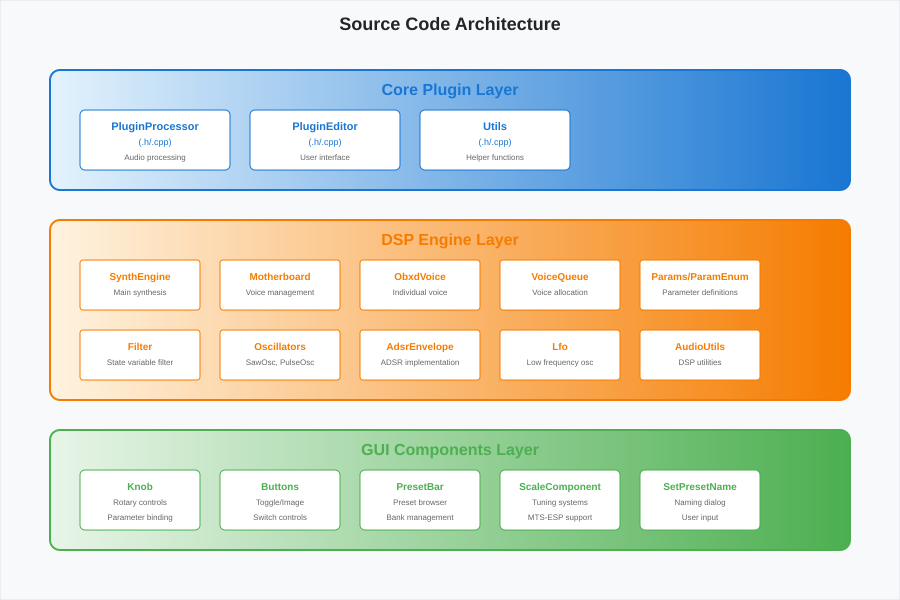
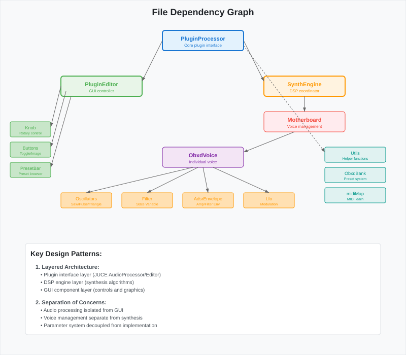

# File Layout Documentation

This document provides a comprehensive overview of the OB-Xd project structure, explaining the organization of source files, their relationships, and the architectural patterns used.

## Project Structure Overview

```
OB-Xd/
├── README.md                    # Project description and build instructions
├── LICENSE                      # GPL3 license file
├── OB-Xd.jucer                 # JUCE project configuration (Windows/Mac)
├── OB-Xd Linux.jucer           # JUCE project configuration (Linux)
├── docs/                       # 📁 Project documentation (this folder)
├── Modules/                    # 📁 JUCE framework modules
├── Source/                     # 📁 Main plugin source code
└── JuceLibraryCode/           # 📁 Generated JUCE files (auto-generated)
```

## Source Code Organization

### Core Plugin Files

```svg


*Source code architecture showing the layered design with core plugin, DSP engine, and GUI component layers.*
  <defs>
    <linearGradient id="coreGradient" x1="0%" y1="0%" x2="100%" y2="0%">
      <stop offset="0%" style="stop-color:#e3f2fd;stop-opacity:1" />
      <stop offset="100%" style="stop-color:#1976d2;stop-opacity:1" />
    </linearGradient>
    <linearGradient id="engineGradient" x1="0%" y1="0%" x2="100%" y2="0%">
      <stop offset="0%" style="stop-color:#fff3e0;stop-opacity:1" />
      <stop offset="100%" style="stop-color:#f57c00;stop-opacity:1" />
    </linearGradient>
    <linearGradient id="guiGradient" x1="0%" y1="0%" x2="100%" y2="0%">
      <stop offset="0%" style="stop-color:#e8f5e8;stop-opacity:1" />
      <stop offset="100%" style="stop-color:#4caf50;stop-opacity:1" />
    </linearGradient>
  </defs>
  
  <!-- Background -->
  <rect width="900" height="600" fill="#f8f9fa" stroke="#dee2e6" stroke-width="1"/>
  
  <!-- Title -->
  <text x="450" y="30" font-family="Arial, sans-serif" font-size="18" font-weight="bold" text-anchor="middle" fill="#212529">Source Code Architecture</text>
  
  <!-- Core Plugin Layer -->
  <rect x="50" y="70" width="800" height="120" fill="url(#coreGradient)" stroke="#1976d2" stroke-width="2" rx="10"/>
  <text x="450" y="95" font-family="Arial, sans-serif" font-size="16" font-weight="bold" text-anchor="middle" fill="#1976d2">Core Plugin Layer</text>
  
  <!-- Core files -->
  <rect x="80" y="110" width="150" height="60" fill="#ffffff" stroke="#1976d2" stroke-width="1" rx="5"/>
  <text x="155" y="130" font-family="Arial, sans-serif" font-size="11" font-weight="bold" text-anchor="middle" fill="#1976d2">PluginProcessor</text>
  <text x="155" y="145" font-family="Arial, sans-serif" font-size="9" text-anchor="middle" fill="#1976d2">(.h/.cpp)</text>
  <text x="155" y="160" font-family="Arial, sans-serif" font-size="8" text-anchor="middle" fill="#666">Audio processing</text>
  
  <rect x="250" y="110" width="150" height="60" fill="#ffffff" stroke="#1976d2" stroke-width="1" rx="5"/>
  <text x="325" y="130" font-family="Arial, sans-serif" font-size="11" font-weight="bold" text-anchor="middle" fill="#1976d2">PluginEditor</text>
  <text x="325" y="145" font-family="Arial, sans-serif" font-size="9" text-anchor="middle" fill="#1976d2">(.h/.cpp)</text>
  <text x="325" y="160" font-family="Arial, sans-serif" font-size="8" text-anchor="middle" fill="#666">User interface</text>
  
  <rect x="420" y="110" width="150" height="60" fill="#ffffff" stroke="#1976d2" stroke-width="1" rx="5"/>
  <text x="495" y="130" font-family="Arial, sans-serif" font-size="11" font-weight="bold" text-anchor="middle" fill="#1976d2">Utils</text>
  <text x="495" y="145" font-family="Arial, sans-serif" font-size="9" text-anchor="middle" fill="#1976d2">(.h/.cpp)</text>
  <text x="495" y="160" font-family="Arial, sans-serif" font-size="8" text-anchor="middle" fill="#666">Helper functions</text>
  
  <!-- DSP Engine Layer -->
  <rect x="50" y="220" width="800" height="180" fill="url(#engineGradient)" stroke="#f57c00" stroke-width="2" rx="10"/>
  <text x="450" y="245" font-family="Arial, sans-serif" font-size="16" font-weight="bold" text-anchor="middle" fill="#f57c00">DSP Engine Layer</text>
  
  <!-- Engine files row 1 -->
  <rect x="80" y="260" width="120" height="50" fill="#ffffff" stroke="#f57c00" stroke-width="1" rx="3"/>
  <text x="140" y="280" font-family="Arial, sans-serif" font-size="10" font-weight="bold" text-anchor="middle" fill="#f57c00">SynthEngine</text>
  <text x="140" y="295" font-family="Arial, sans-serif" font-size="8" text-anchor="middle" fill="#666">Main synthesis</text>
  
  <rect x="220" y="260" width="120" height="50" fill="#ffffff" stroke="#f57c00" stroke-width="1" rx="3"/>
  <text x="280" y="280" font-family="Arial, sans-serif" font-size="10" font-weight="bold" text-anchor="middle" fill="#f57c00">Motherboard</text>
  <text x="280" y="295" font-family="Arial, sans-serif" font-size="8" text-anchor="middle" fill="#666">Voice management</text>
  
  <rect x="360" y="260" width="120" height="50" fill="#ffffff" stroke="#f57c00" stroke-width="1" rx="3"/>
  <text x="420" y="280" font-family="Arial, sans-serif" font-size="10" font-weight="bold" text-anchor="middle" fill="#f57c00">ObxdVoice</text>
  <text x="420" y="295" font-family="Arial, sans-serif" font-size="8" text-anchor="middle" fill="#666">Individual voice</text>
  
  <rect x="500" y="260" width="120" height="50" fill="#ffffff" stroke="#f57c00" stroke-width="1" rx="3"/>
  <text x="560" y="280" font-family="Arial, sans-serif" font-size="10" font-weight="bold" text-anchor="middle" fill="#f57c00">VoiceQueue</text>
  <text x="560" y="295" font-family="Arial, sans-serif" font-size="8" text-anchor="middle" fill="#666">Voice allocation</text>
  
  <rect x="640" y="260" width="120" height="50" fill="#ffffff" stroke="#f57c00" stroke-width="1" rx="3"/>
  <text x="700" y="280" font-family="Arial, sans-serif" font-size="10" font-weight="bold" text-anchor="middle" fill="#f57c00">Params/ParamEnum</text>
  <text x="700" y="295" font-family="Arial, sans-serif" font-size="8" text-anchor="middle" fill="#666">Parameter definitions</text>
  
  <!-- Engine files row 2 -->
  <rect x="80" y="330" width="120" height="50" fill="#ffffff" stroke="#f57c00" stroke-width="1" rx="3"/>
  <text x="140" y="350" font-family="Arial, sans-serif" font-size="10" font-weight="bold" text-anchor="middle" fill="#f57c00">Filter</text>
  <text x="140" y="365" font-family="Arial, sans-serif" font-size="8" text-anchor="middle" fill="#666">State variable filter</text>
  
  <rect x="220" y="330" width="120" height="50" fill="#ffffff" stroke="#f57c00" stroke-width="1" rx="3"/>
  <text x="280" y="350" font-family="Arial, sans-serif" font-size="10" font-weight="bold" text-anchor="middle" fill="#f57c00">Oscillators</text>
  <text x="280" y="365" font-family="Arial, sans-serif" font-size="8" text-anchor="middle" fill="#666">SawOsc, PulseOsc</text>
  
  <rect x="360" y="330" width="120" height="50" fill="#ffffff" stroke="#f57c00" stroke-width="1" rx="3"/>
  <text x="420" y="350" font-family="Arial, sans-serif" font-size="10" font-weight="bold" text-anchor="middle" fill="#f57c00">AdsrEnvelope</text>
  <text x="420" y="365" font-family="Arial, sans-serif" font-size="8" text-anchor="middle" fill="#666">ADSR implementation</text>
  
  <rect x="500" y="330" width="120" height="50" fill="#ffffff" stroke="#f57c00" stroke-width="1" rx="3"/>
  <text x="560" y="350" font-family="Arial, sans-serif" font-size="10" font-weight="bold" text-anchor="middle" fill="#f57c00">Lfo</text>
  <text x="560" y="365" font-family="Arial, sans-serif" font-size="8" text-anchor="middle" fill="#666">Low frequency osc</text>
  
  <rect x="640" y="330" width="120" height="50" fill="#ffffff" stroke="#f57c00" stroke-width="1" rx="3"/>
  <text x="700" y="350" font-family="Arial, sans-serif" font-size="10" font-weight="bold" text-anchor="middle" fill="#f57c00">AudioUtils</text>
  <text x="700" y="365" font-family="Arial, sans-serif" font-size="8" text-anchor="middle" fill="#666">DSP utilities</text>
  
  <!-- GUI Layer -->
  <rect x="50" y="430" width="800" height="120" fill="url(#guiGradient)" stroke="#4caf50" stroke-width="2" rx="10"/>
  <text x="450" y="455" font-family="Arial, sans-serif" font-size="16" font-weight="bold" text-anchor="middle" fill="#4caf50">GUI Components Layer</text>
  
  <!-- GUI components -->
  <rect x="80" y="470" width="120" height="60" fill="#ffffff" stroke="#4caf50" stroke-width="1" rx="5"/>
  <text x="140" y="490" font-family="Arial, sans-serif" font-size="10" font-weight="bold" text-anchor="middle" fill="#4caf50">Knob</text>
  <text x="140" y="505" font-family="Arial, sans-serif" font-size="8" text-anchor="middle" fill="#666">Rotary controls</text>
  <text x="140" y="520" font-family="Arial, sans-serif" font-size="8" text-anchor="middle" fill="#666">Parameter binding</text>
  
  <rect x="220" y="470" width="120" height="60" fill="#ffffff" stroke="#4caf50" stroke-width="1" rx="5"/>
  <text x="280" y="490" font-family="Arial, sans-serif" font-size="10" font-weight="bold" text-anchor="middle" fill="#4caf50">Buttons</text>
  <text x="280" y="505" font-family="Arial, sans-serif" font-size="8" text-anchor="middle" fill="#666">Toggle/Image</text>
  <text x="280" y="520" font-family="Arial, sans-serif" font-size="8" text-anchor="middle" fill="#666">Switch controls</text>
  
  <rect x="360" y="470" width="120" height="60" fill="#ffffff" stroke="#4caf50" stroke-width="1" rx="5"/>
  <text x="420" y="490" font-family="Arial, sans-serif" font-size="10" font-weight="bold" text-anchor="middle" fill="#4caf50">PresetBar</text>
  <text x="420" y="505" font-family="Arial, sans-serif" font-size="8" text-anchor="middle" fill="#666">Preset browser</text>
  <text x="420" y="520" font-family="Arial, sans-serif" font-size="8" text-anchor="middle" fill="#666">Bank management</text>
  
  <rect x="500" y="470" width="120" height="60" fill="#ffffff" stroke="#4caf50" stroke-width="1" rx="5"/>
  <text x="560" y="490" font-family="Arial, sans-serif" font-size="10" font-weight="bold" text-anchor="middle" fill="#4caf50">ScaleComponent</text>
  <text x="560" y="505" font-family="Arial, sans-serif" font-size="8" text-anchor="middle" fill="#666">Tuning systems</text>
  <text x="560" y="520" font-family="Arial, sans-serif" font-size="8" text-anchor="middle" fill="#666">MTS-ESP support</text>
  
  <rect x="640" y="470" width="120" height="60" fill="#ffffff" stroke="#4caf50" stroke-width="1" rx="5"/>
  <text x="700" y="490" font-family="Arial, sans-serif" font-size="10" font-weight="bold" text-anchor="middle" fill="#4caf50">SetPresetName</text>
  <text x="700" y="505" font-family="Arial, sans-serif" font-size="8" text-anchor="middle" fill="#666">Naming dialog</text>
  <text x="700" y="520" font-family="Arial, sans-serif" font-size="8" text-anchor="middle" fill="#666">User input</text>
</svg>
```

## Detailed Directory Structure

### Source/ Directory

```
Source/
├── PluginProcessor.cpp         # Main plugin audio processing
├── PluginProcessor.h          # Plugin interface declarations
├── PluginEditor.cpp           # GUI implementation
├── PluginEditor.h             # GUI interface declarations
├── Utils.cpp                  # Utility functions
├── Utils.h                    # Utility declarations
├── Components/                # GUI component implementations
├── Engine/                    # DSP and synthesis engine
├── Gui/                       # Basic GUI controls
├── Images/                    # Graphical assets
└── MTS/                       # Micro-tuning support
```

### Engine/ Subsystem

The Engine directory contains the core synthesis functionality:

```
Engine/
├── SynthEngine.h              # Main synthesis coordinator
├── Motherboard.h              # Polyphonic voice management
├── ObxdVoice.h               # Individual voice implementation
├── VoiceQueue.h              # Voice allocation algorithms
├── Params.h                  # Parameter value storage
├── ParamsEnum.h              # Parameter ID definitions
├── ParamSmoother.h           # Parameter interpolation
├── midiMap.h                 # MIDI CC mapping
├── ObxdBank.h                # Preset/bank management
├── Filter.h                  # State variable filter
├── ObxdOscillatorB.h         # Dual oscillator block
├── SawOsc.h                  # Sawtooth oscillator
├── PulseOsc.h                # Pulse wave oscillator
├── TriangleOsc.h             # Triangle wave oscillator
├── AdsrEnvelope.h            # ADSR envelope generator
├── Lfo.h                     # Low frequency oscillator
├── AudioUtils.h              # DSP utility functions
├── Decimator.h               # Anti-aliasing filters
├── DelayLine.h               # Delay line implementation
├── APInterpolator.h          # All-pass interpolation
├── BlepData.h                # Band-limited step data
└── Tuning.h                  # Alternative tuning systems
```

### Components/ Directory

```
Components/
├── PresetBar.cpp             # Preset browser implementation
├── PresetBar.h               # Preset browser interface
├── ScaleComponent.cpp        # Tuning system selector
├── ScaleComponent.h          # Tuning interface
├── SetPresetNameWindow.cpp   # Preset naming dialog
└── SetPresetNameWindow.h     # Dialog interface
```

### Gui/ Directory

```
Gui/
├── Knob.h                    # Rotary knob control
├── TooglableButton.h         # Toggle button control
├── ButtonList.h              # Multi-option button list
└── ImageButton.h             # Image-based button
```

### Images/ Directory

```
Images/
├── appicon.png               # Application icon
├── main.png                  # Main interface background (1x)
├── main@2x.png              # High-DPI interface (2x)
├── main@4x.png              # Ultra high-DPI interface (4x)
├── main.psd                 # Source Photoshop file
├── menu.png                 # Menu graphics (1x)
├── menu@2x.png              # Menu graphics (2x)
├── menu@4x.png              # Menu graphics (4x)
└── presetnavigation.svg     # Preset navigation icons
```

### MTS/ Directory

```
MTS/
├── libMTSClient.cpp          # MTS-ESP client implementation
└── libMTSClient.h            # MTS-ESP client interface
```

## File Dependencies and Relationships

```svg


*File dependency graph showing relationships between core plugin files, DSP engine components, and GUI elements.*
  <defs>
    <marker id="dep-arrow" markerWidth="8" markerHeight="6" refX="8" refY="3" orient="auto">
      <polygon points="0 0, 8 3, 0 6" fill="#666"/>
    </marker>
  </defs>
  
  <!-- Background -->
  <rect width="800" height="700" fill="#f8f9fa" stroke="#dee2e6" stroke-width="1"/>
  
  <!-- Title -->
  <text x="400" y="30" font-family="Arial, sans-serif" font-size="18" font-weight="bold" text-anchor="middle" fill="#212529">File Dependency Graph</text>
  
  <!-- Plugin Core -->
  <rect x="320" y="60" width="160" height="40" fill="#e3f2fd" stroke="#1976d2" stroke-width="2" rx="5"/>
  <text x="400" y="80" font-family="Arial, sans-serif" font-size="11" font-weight="bold" text-anchor="middle" fill="#1976d2">PluginProcessor</text>
  <text x="400" y="92" font-family="Arial, sans-serif" font-size="8" text-anchor="middle" fill="#1976d2">Core plugin interface</text>
  
  <!-- Plugin Editor -->
  <rect x="120" y="150" width="160" height="40" fill="#e8f5e8" stroke="#4caf50" stroke-width="2" rx="5"/>
  <text x="200" y="170" font-family="Arial, sans-serif" font-size="11" font-weight="bold" text-anchor="middle" fill="#4caf50">PluginEditor</text>
  <text x="200" y="182" font-family="Arial, sans-serif" font-size="8" text-anchor="middle" fill="#4caf50">GUI controller</text>
  
  <!-- Synth Engine -->
  <rect x="520" y="150" width="160" height="40" fill="#fff3e0" stroke="#ff9800" stroke-width="2" rx="5"/>
  <text x="600" y="170" font-family="Arial, sans-serif" font-size="11" font-weight="bold" text-anchor="middle" fill="#ff9800">SynthEngine</text>
  <text x="600" y="182" font-family="Arial, sans-serif" font-size="8" text-anchor="middle" fill="#ff9800">DSP coordinator</text>
  
  <!-- Motherboard -->
  <rect x="520" y="220" width="160" height="40" fill="#ffebee" stroke="#f44336" stroke-width="1" rx="5"/>
  <text x="600" y="240" font-family="Arial, sans-serif" font-size="11" font-weight="bold" text-anchor="middle" fill="#f44336">Motherboard</text>
  <text x="600" y="252" font-family="Arial, sans-serif" font-size="8" text-anchor="middle" fill="#f44336">Voice management</text>
  
  <!-- Voice -->
  <rect x="320" y="290" width="160" height="40" fill="#f3e5f5" stroke="#7b1fa2" stroke-width="1" rx="5"/>
  <text x="400" y="310" font-family="Arial, sans-serif" font-size="11" font-weight="bold" text-anchor="middle" fill="#7b1fa2">ObxdVoice</text>
  <text x="400" y="322" font-family="Arial, sans-serif" font-size="8" text-anchor="middle" fill="#7b1fa2">Individual voice</text>
  
  <!-- DSP Components -->
  <rect x="120" y="380" width="100" height="30" fill="#ffe0b2" stroke="#ff9800" stroke-width="1" rx="3"/>
  <text x="170" y="395" font-family="Arial, sans-serif" font-size="9" text-anchor="middle" fill="#ff9800">Oscillators</text>
  <text x="170" y="405" font-family="Arial, sans-serif" font-size="7" text-anchor="middle" fill="#ff9800">Saw/Pulse/Triangle</text>
  
  <rect x="240" y="380" width="100" height="30" fill="#ffe0b2" stroke="#ff9800" stroke-width="1" rx="3"/>
  <text x="290" y="395" font-family="Arial, sans-serif" font-size="9" text-anchor="middle" fill="#ff9800">Filter</text>
  <text x="290" y="405" font-family="Arial, sans-serif" font-size="7" text-anchor="middle" fill="#ff9800">State Variable</text>
  
  <rect x="360" y="380" width="100" height="30" fill="#ffe0b2" stroke="#ff9800" stroke-width="1" rx="3"/>
  <text x="410" y="395" font-family="Arial, sans-serif" font-size="9" text-anchor="middle" fill="#ff9800">AdsrEnvelope</text>
  <text x="410" y="405" font-family="Arial, sans-serif" font-size="7" text-anchor="middle" fill="#ff9800">Amp/Filter Env</text>
  
  <rect x="480" y="380" width="100" height="30" fill="#ffe0b2" stroke="#ff9800" stroke-width="1" rx="3"/>
  <text x="530" y="395" font-family="Arial, sans-serif" font-size="9" text-anchor="middle" fill="#ff9800">Lfo</text>
  <text x="530" y="405" font-family="Arial, sans-serif" font-size="7" text-anchor="middle" fill="#ff9800">Modulation</text>
  
  <!-- GUI Components -->
  <rect x="20" y="240" width="80" height="30" fill="#c8e6c9" stroke="#4caf50" stroke-width="1" rx="3"/>
  <text x="60" y="255" font-family="Arial, sans-serif" font-size="9" text-anchor="middle" fill="#4caf50">Knob</text>
  <text x="60" y="265" font-family="Arial, sans-serif" font-size="7" text-anchor="middle" fill="#4caf50">Rotary control</text>
  
  <rect x="20" y="280" width="80" height="30" fill="#c8e6c9" stroke="#4caf50" stroke-width="1" rx="3"/>
  <text x="60" y="295" font-family="Arial, sans-serif" font-size="9" text-anchor="middle" fill="#4caf50">Buttons</text>
  <text x="60" y="305" font-family="Arial, sans-serif" font-size="7" text-anchor="middle" fill="#4caf50">Toggle/Image</text>
  
  <rect x="20" y="320" width="80" height="30" fill="#c8e6c9" stroke="#4caf50" stroke-width="1" rx="3"/>
  <text x="60" y="335" font-family="Arial, sans-serif" font-size="9" text-anchor="middle" fill="#4caf50">PresetBar</text>
  <text x="60" y="345" font-family="Arial, sans-serif" font-size="7" text-anchor="middle" fill="#4caf50">Preset browser</text>
  
  <!-- Utility and Support -->
  <rect x="640" y="290" width="120" height="30" fill="#e0f2f1" stroke="#009688" stroke-width="1" rx="3"/>
  <text x="700" y="305" font-family="Arial, sans-serif" font-size="9" text-anchor="middle" fill="#009688">Utils</text>
  <text x="700" y="315" font-family="Arial, sans-serif" font-size="7" text-anchor="middle" fill="#009688">Helper functions</text>
  
  <rect x="640" y="330" width="120" height="30" fill="#e0f2f1" stroke="#009688" stroke-width="1" rx="3"/>
  <text x="700" y="345" font-family="Arial, sans-serif" font-size="9" text-anchor="middle" fill="#009688">ObxdBank</text>
  <text x="700" y="355" font-family="Arial, sans-serif" font-size="7" text-anchor="middle" fill="#009688">Preset system</text>
  
  <rect x="640" y="370" width="120" height="30" fill="#e0f2f1" stroke="#009688" stroke-width="1" rx="3"/>
  <text x="700" y="385" font-family="Arial, sans-serif" font-size="9" text-anchor="middle" fill="#009688">midiMap</text>
  <text x="700" y="395" font-family="Arial, sans-serif" font-size="7" text-anchor="middle" fill="#009688">MIDI learn</text>
  
  <!-- Dependency arrows -->
  <!-- Processor to Engine -->
  <line x1="480" y1="80" x2="520" y2="160" stroke="#666" stroke-width="1" marker-end="url(#dep-arrow)"/>
  
  <!-- Processor to Editor -->
  <line x1="320" y1="80" x2="280" y2="160" stroke="#666" stroke-width="1" marker-end="url(#dep-arrow)"/>
  
  <!-- Engine to Motherboard -->
  <line x1="600" y1="190" x2="600" y2="220" stroke="#666" stroke-width="1" marker-end="url(#dep-arrow)"/>
  
  <!-- Motherboard to Voice -->
  <line x1="580" y1="260" x2="480" y2="300" stroke="#666" stroke-width="1" marker-end="url(#dep-arrow)"/>
  
  <!-- Voice to DSP components -->
  <line x1="380" y1="330" x2="170" y2="380" stroke="#666" stroke-width="1" marker-end="url(#dep-arrow)"/>
  <line x1="390" y1="330" x2="290" y2="380" stroke="#666" stroke-width="1" marker-end="url(#dep-arrow)"/>
  <line x1="400" y1="330" x2="410" y2="380" stroke="#666" stroke-width="1" marker-end="url(#dep-arrow)"/>
  <line x1="420" y1="330" x2="530" y2="380" stroke="#666" stroke-width="1" marker-end="url(#dep-arrow)"/>
  
  <!-- Editor to GUI components -->
  <line x1="120" y1="170" x2="100" y2="250" stroke="#666" stroke-width="1" marker-end="url(#dep-arrow)"/>
  <line x1="130" y1="180" x2="100" y2="290" stroke="#666" stroke-width="1" marker-end="url(#dep-arrow)"/>
  <line x1="140" y1="190" x2="100" y2="330" stroke="#666" stroke-width="1" marker-end="url(#dep-arrow)"/>
  
  <!-- Processor to Utils -->
  <line x1="480" y1="90" x2="640" y2="300" stroke="#666" stroke-width="1" stroke-dasharray="3,3" marker-end="url(#dep-arrow)"/>
  
  <!-- Legend -->
  <rect x="50" y="480" width="700" height="180" fill="#ffffff" stroke="#dee2e6" stroke-width="1" rx="5"/>
  <text x="60" y="505" font-family="Arial, sans-serif" font-size="14" font-weight="bold" fill="#212529">Key Design Patterns:</text>
  
  <text x="70" y="530" font-family="Arial, sans-serif" font-size="11" font-weight="bold" fill="#495057">1. Layered Architecture:</text>
  <text x="80" y="545" font-family="Arial, sans-serif" font-size="10" fill="#495057">• Plugin interface layer (JUCE AudioProcessor/Editor)</text>
  <text x="80" y="560" font-family="Arial, sans-serif" font-size="10" fill="#495057">• DSP engine layer (synthesis algorithms)</text>
  <text x="80" y="575" font-family="Arial, sans-serif" font-size="10" fill="#495057">• GUI component layer (controls and graphics)</text>
  
  <text x="70" y="600" font-family="Arial, sans-serif" font-size="11" font-weight="bold" fill="#495057">2. Separation of Concerns:</text>
  <text x="80" y="615" font-family="Arial, sans-serif" font-size="10" fill="#495057">• Audio processing isolated from GUI</text>
  <text x="80" y="630" font-family="Arial, sans-serif" font-size="10" fill="#495057">• Voice management separate from synthesis</text>
  <text x="80" y="645" font-family="Arial, sans-serif" font-size="10" fill="#495057">• Parameter system decoupled from implementation</text>
</svg>
```

## Build System and Configuration

### JUCE Project Files

- **OB-Xd.jucer**: Main project configuration for Windows/macOS
- **OB-Xd Linux.jucer**: Linux-specific configuration
- These files configure:
  - Plugin formats (VST3, AU, AAX)
  - Build targets and platforms
  - Module dependencies
  - Preprocessor definitions

### Module Dependencies

```
Modules/
├── juce_audio_plugin_client/    # Plugin wrapper framework
├── juce_gui_basics/            # Basic GUI components
├── juce_core/                  # Core JUCE functionality
├── juce_audio_basics/          # Audio data structures
├── juce_audio_processors/      # Plugin host interface
├── juce_audio_utils/           # Audio utilities
├── juce_data_structures/       # Data containers
├── juce_events/               # Event system
├── juce_graphics/             # 2D graphics
└── juce_gui_extra/            # Extended GUI components
```

## Code Organization Principles

### 1. Single Responsibility

Each file has a clearly defined purpose:
- `PluginProcessor`: Audio processing and parameter management
- `SynthEngine`: Coordinates synthesis components
- `ObxdVoice`: Implements individual voice synthesis
- `Filter`: Implements filter algorithms only

### 2. Minimal Dependencies

- Header files include only necessary dependencies
- Forward declarations used where possible
- Circular dependencies avoided through careful design

### 3. Consistent Naming

```cpp
// Classes: PascalCase
class ObxdVoice;
class SynthEngine;

// Files: Match class names
ObxdVoice.h
SynthEngine.h

// Constants: UPPER_SNAKE_CASE
const int MAX_VOICES = 32;
const float DEFAULT_CUTOFF = 1.0f;

// Variables: camelCase
float cutoffFrequency;
bool isActive;
```

### 4. Header-Only DSP Components

Many DSP components are header-only for performance:
- Oscillators (inline processing)
- Filters (template optimization)
- Envelopes (tight CPU loops)

### 5. Resource Management

- RAII principles throughout
- Smart pointers where appropriate
- Automatic cleanup in destructors
- No manual memory management in hot paths

## File Size and Complexity Metrics

| Component | Files | Lines of Code | Complexity |
|-----------|-------|---------------|------------|
| Core Plugin | 6 | ~2,500 | Medium |
| DSP Engine | 20+ | ~4,000 | High |
| GUI Components | 10 | ~1,500 | Medium |
| Utilities | 5 | ~800 | Low |
| **Total** | **40+** | **~8,800** | **Medium-High** |

## Memory Layout Considerations

### Voice Pool Organization

```cpp
// Motherboard.h - Efficient voice storage
class Motherboard
{
private:
    ObxdVoice voices[MAX_VOICES];  // Contiguous memory allocation
    float pannings[MAX_PANNINGS];  // Cache-friendly access
    // ...
};
```

### Parameter Storage

```cpp
// Params.h - Flat parameter array
class ObxdParams
{
public:
    float values[PARAM_COUNT];  // Direct indexing, cache-friendly
    // No indirection or hash tables in audio thread
};
```

This file organization ensures:
- **Maintainable codebase** with clear separation of concerns
- **Efficient compilation** through minimal dependencies
- **Performance optimization** via strategic memory layout
- **Easy testing** of individual components
- **Scalable architecture** for future enhancements
