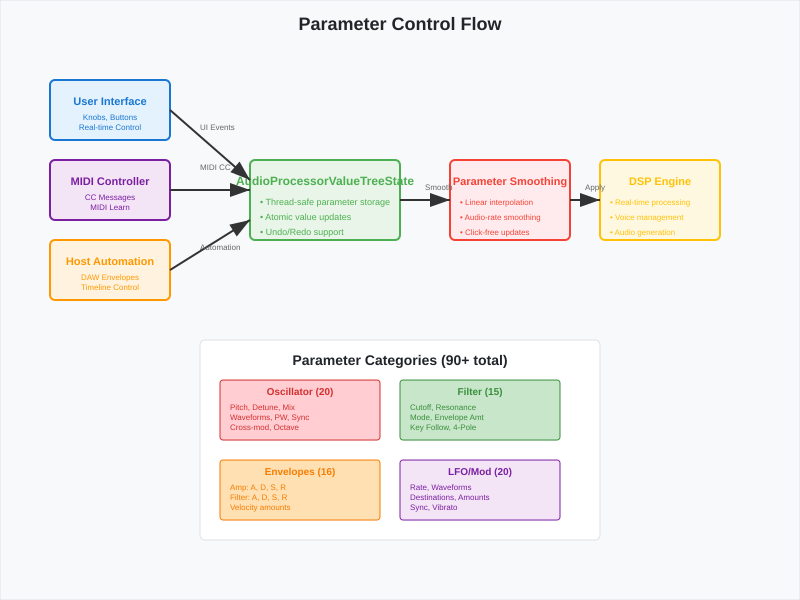
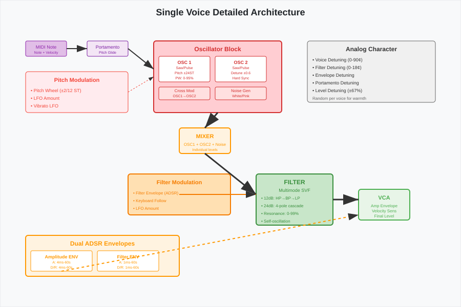

# Plug

*Parameter control flow showing how GUI changes propagate through the parameter system to affect DSP processing.*lete Signal Flow](diagrams/complete-signal-flow.svg)

*Complete signal flow diagram showing the path from MIDI input through synthesis engines to final audio output

*Single voice architecture detail showing oscillator mixing, filter processing, and envelope modulation within one synthesis voice.* Flow Diagram

This document provides a comprehensive visual representation of the OB-Xd synthesizer's signal flow and processing architecture.

## High-Level Signal Flow

```svg
<svg width="1000" height="800" xmlns="http://www.w3.org/2000/svg">
  <defs>
    <marker id="arrowhead" markerWidth="10" markerHeight="7" refX="10" refY="3.5" orient="auto">
      <polygon points="0 0, 10 3.5, 0 7" fill="#333"/>
    </marker>
    <linearGradient id="oscGradient" x1="0%" y1="0%" x2="100%" y2="0%">
      <stop offset="0%" style="stop-color:#ffcdd2;stop-opacity:1" />
      <stop offset="100%" style="stop-color:#ef5350;stop-opacity:1" />
    </linearGradient>
    <linearGradient id="filterGradient" x1="0%" y1="0%" x2="100%" y2="0%">
      <stop offset="0%" style="stop-color:#c8e6c9;stop-opacity:1" />
      <stop offset="100%" style="stop-color:#66bb6a;stop-opacity:1" />
    </linearGradient>
    <linearGradient id="envGradient" x1="0%" y1="0%" x2="100%" y2="0%">
      <stop offset="0%" style="stop-color:#ffe0b2;stop-opacity:1" />
      <stop offset="100%" style="stop-color:#ffb74d;stop-opacity:1" />
    </linearGradient>
  </defs>
  
  <!-- Background -->
  <rect width="1000" height="800" fill="#f8f9fa" stroke="#dee2e6" stroke-width="1"/>
  
  <!-- Title -->
  <text x="500" y="30" font-family="Arial, sans-serif" font-size="20" font-weight="bold" text-anchor="middle" fill="#212529">OB-Xd Complete Signal Flow</text>
  
  <!-- MIDI Input -->
  <rect x="50" y="70" width="80" height="40" fill="#e1bee7" stroke="#8e24aa" stroke-width="2" rx="5"/>
  <text x="90" y="85" font-family="Arial, sans-serif" font-size="10" text-anchor="middle" fill="#8e24aa">MIDI</text>
  <text x="90" y="98" font-family="Arial, sans-serif" font-size="8" text-anchor="middle" fill="#8e24aa">Note/CC</text>
  
  <!-- Voice Manager -->
  <rect x="170" y="70" width="100" height="40" fill="#e8eaf6" stroke="#3f51b5" stroke-width="2" rx="5"/>
  <text x="220" y="85" font-family="Arial, sans-serif" font-size="10" text-anchor="middle" fill="#3f51b5">Voice Manager</text>
  <text x="220" y="98" font-family="Arial, sans-serif" font-size="8" text-anchor="middle" fill="#3f51b5">Allocation</text>
  
  <!-- LFO Section -->
  <rect x="50" y="150" width="100" height="60" fill="#f3e5f5" stroke="#7b1fa2" stroke-width="2" rx="5"/>
  <text x="100" y="170" font-family="Arial, sans-serif" font-size="12" font-weight="bold" text-anchor="middle" fill="#7b1fa2">LFO</text>
  <text x="100" y="185" font-family="Arial, sans-serif" font-size="9" text-anchor="middle" fill="#7b1fa2">Sin/Sqr/S&amp;H</text>
  <text x="100" y="198" font-family="Arial, sans-serif" font-size="8" text-anchor="middle" fill="#7b1fa2">0.1-50Hz</text>
  
  <!-- Oscillator 1 -->
  <rect x="200" y="150" width="100" height="80" fill="url(#oscGradient)" stroke="#d32f2f" stroke-width="2" rx="5"/>
  <text x="250" y="175" font-family="Arial, sans-serif" font-size="12" font-weight="bold" text-anchor="middle" fill="#d32f2f">OSC 1</text>
  <text x="250" y="190" font-family="Arial, sans-serif" font-size="9" text-anchor="middle" fill="#d32f2f">Saw/Pulse</text>
  <text x="250" y="203" font-family="Arial, sans-serif" font-size="8" text-anchor="middle" fill="#d32f2f">Pitch ±24ST</text>
  <text x="250" y="216" font-family="Arial, sans-serif" font-size="8" text-anchor="middle" fill="#d32f2f">PW Mod</text>
  
  <!-- Oscillator 2 -->
  <rect x="320" y="150" width="100" height="80" fill="url(#oscGradient)" stroke="#d32f2f" stroke-width="2" rx="5"/>
  <text x="370" y="175" font-family="Arial, sans-serif" font-size="12" font-weight="bold" text-anchor="middle" fill="#d32f2f">OSC 2</text>
  <text x="370" y="190" font-family="Arial, sans-serif" font-size="9" text-anchor="middle" fill="#d32f2f">Saw/Pulse</text>
  <text x="370" y="203" font-family="Arial, sans-serif" font-size="8" text-anchor="middle" fill="#d32f2f">Detune</text>
  <text x="370" y="216" font-family="Arial, sans-serif" font-size="8" text-anchor="middle" fill="#d32f2f">Hard Sync</text>
  
  <!-- Noise Generator -->
  <rect x="440" y="150" width="80" height="60" fill="#ffcdd2" stroke="#f44336" stroke-width="2" rx="5"/>
  <text x="480" y="175" font-family="Arial, sans-serif" font-size="11" font-weight="bold" text-anchor="middle" fill="#f44336">NOISE</text>
  <text x="480" y="190" font-family="Arial, sans-serif" font-size="8" text-anchor="middle" fill="#f44336">White/Pink</text>
  
  <!-- Mixer -->
  <rect x="300" y="270" width="80" height="40" fill="#fff3e0" stroke="#ff9800" stroke-width="2" rx="5"/>
  <text x="340" y="285" font-family="Arial, sans-serif" font-size="11" font-weight="bold" text-anchor="middle" fill="#ff9800">MIXER</text>
  <text x="340" y="298" font-family="Arial, sans-serif" font-size="8" text-anchor="middle" fill="#ff9800">O1+O2+N</text>
  
  <!-- Filter -->
  <rect x="450" y="350" width="120" height="80" fill="url(#filterGradient)" stroke="#388e3c" stroke-width="2" rx="5"/>
  <text x="510" y="375" font-family="Arial, sans-serif" font-size="12" font-weight="bold" text-anchor="middle" fill="#388e3c">FILTER</text>
  <text x="510" y="390" font-family="Arial, sans-serif" font-size="9" text-anchor="middle" fill="#388e3c">12/24dB</text>
  <text x="510" y="403" font-family="Arial, sans-serif" font-size="8" text-anchor="middle" fill="#388e3c">LP/BP/HP</text>
  <text x="510" y="416" font-family="Arial, sans-serif" font-size="8" text-anchor="middle" fill="#388e3c">Resonance</text>
  
  <!-- Filter Envelope -->
  <rect x="300" y="350" width="100" height="60" fill="url(#envGradient)" stroke="#f57c00" stroke-width="2" rx="5"/>
  <text x="350" y="370" font-family="Arial, sans-serif" font-size="11" font-weight="bold" text-anchor="middle" fill="#f57c00">Filter ENV</text>
  <text x="350" y="385" font-family="Arial, sans-serif" font-size="8" text-anchor="middle" fill="#f57c00">ADSR</text>
  <text x="350" y="398" font-family="Arial, sans-serif" font-size="8" text-anchor="middle" fill="#f57c00">Amount</text>
  
  <!-- Amplitude Envelope -->
  <rect x="300" y="470" width="100" height="60" fill="url(#envGradient)" stroke="#f57c00" stroke-width="2" rx="5"/>
  <text x="350" y="490" font-family="Arial, sans-serif" font-size="11" font-weight="bold" text-anchor="middle" fill="#f57c00">Amp ENV</text>
  <text x="350" y="505" font-family="Arial, sans-serif" font-size="8" text-anchor="middle" fill="#f57c00">ADSR</text>
  <text x="350" y="518" font-family="Arial, sans-serif" font-size="8" text-anchor="middle" fill="#f57c00">Velocity</text>
  
  <!-- VCA -->
  <rect x="600" y="450" width="80" height="40" fill="#e8f5e8" stroke="#4caf50" stroke-width="2" rx="5"/>
  <text x="640" y="465" font-family="Arial, sans-serif" font-size="11" font-weight="bold" text-anchor="middle" fill="#4caf50">VCA</text>
  <text x="640" y="478" font-family="Arial, sans-serif" font-size="8" text-anchor="middle" fill="#4caf50">Final Gain</text>
  
  <!-- Pan -->
  <rect x="750" y="430" width="60" height="80" fill="#f3e5f5" stroke="#9c27b0" stroke-width="2" rx="5"/>
  <text x="780" y="455" font-family="Arial, sans-serif" font-size="11" font-weight="bold" text-anchor="middle" fill="#9c27b0">PAN</text>
  <text x="780" y="470" font-family="Arial, sans-serif" font-size="8" text-anchor="middle" fill="#9c27b0">L/R</text>
  <text x="780" y="485" font-family="Arial, sans-serif" font-size="8" text-anchor="middle" fill="#9c27b0">Per Voice</text>
  
  <!-- Output -->
  <rect x="850" y="450" width="80" height="40" fill="#e0f2f1" stroke="#009688" stroke-width="2" rx="5"/>
  <text x="890" y="465" font-family="Arial, sans-serif" font-size="11" font-weight="bold" text-anchor="middle" fill="#009688">OUTPUT</text>
  <text x="890" y="478" font-family="Arial, sans-serif" font-size="8" text-anchor="middle" fill="#009688">Stereo</text>
  
  <!-- Main signal flow arrows -->
  <line x1="130" y1="90" x2="170" y2="90" stroke="#333" stroke-width="2" marker-end="url(#arrowhead)"/>
  <line x1="270" y1="90" x2="250" y2="150" stroke="#333" stroke-width="2" marker-end="url(#arrowhead)"/>
  <line x1="270" y1="90" x2="370" y2="150" stroke="#333" stroke-width="2" marker-end="url(#arrowhead)"/>
  
  <!-- Oscillator to mixer -->
  <line x1="250" y1="230" x2="320" y2="270" stroke="#333" stroke-width="2" marker-end="url(#arrowhead)"/>
  <line x1="370" y1="230" x2="360" y2="270" stroke="#333" stroke-width="2" marker-end="url(#arrowhead)"/>
  <line x1="480" y1="210" x2="340" y2="270" stroke="#333" stroke-width="2" marker-end="url(#arrowhead)"/>
  
  <!-- Mixer to filter -->
  <line x1="380" y1="290" x2="450" y2="380" stroke="#333" stroke-width="3" marker-end="url(#arrowhead)"/>
  
  <!-- Filter to VCA -->
  <line x1="570" y1="390" x2="600" y2="460" stroke="#333" stroke-width="3" marker-end="url(#arrowhead)"/>
  
  <!-- VCA to Pan -->
  <line x1="680" y1="470" x2="750" y2="470" stroke="#333" stroke-width="3" marker-end="url(#arrowhead)"/>
  
  <!-- Pan to Output -->
  <line x1="810" y1="470" x2="850" y2="470" stroke="#333" stroke-width="3" marker-end="url(#arrowhead)"/>
  
  <!-- Modulation arrows -->
  <!-- LFO to oscillators -->
  <line x1="150" y1="180" x2="200" y2="180" stroke="#7b1fa2" stroke-width="1" stroke-dasharray="3,3" marker-end="url(#arrowhead)"/>
  <line x1="150" y1="190" x2="320" y2="190" stroke="#7b1fa2" stroke-width="1" stroke-dasharray="3,3" marker-end="url(#arrowhead)"/>
  
  <!-- LFO to filter -->
  <path d="M 150,200 Q 300,250 450,370" fill="none" stroke="#7b1fa2" stroke-width="1" stroke-dasharray="3,3" marker-end="url(#arrowhead)"/>
  
  <!-- Filter envelope to filter -->
  <line x1="400" y1="380" x2="450" y2="380" stroke="#f57c00" stroke-width="2" marker-end="url(#arrowhead)"/>
  
  <!-- Amp envelope to VCA -->
  <line x1="400" y1="500" x2="600" y2="480" stroke="#f57c00" stroke-width="2" marker-end="url(#arrowhead)"/>
  
  <!-- Modulation labels -->
  <text x="175" y="170" font-family="Arial, sans-serif" font-size="7" fill="#7b1fa2">Pitch</text>
  <text x="235" y="180" font-family="Arial, sans-serif" font-size="7" fill="#7b1fa2">PW</text>
  <text x="385" y="330" font-family="Arial, sans-serif" font-size="7" fill="#f57c00">Cutoff</text>
  <text x="520" y="490" font-family="Arial, sans-serif" font-size="7" fill="#f57c00">Amplitude</text>
  
  <!-- Voice count indicator -->
  <rect x="50" y="550" width="200" height="80" fill="#ffffff" stroke="#dee2e6" stroke-width="1" rx="5"/>
  <text x="150" y="570" font-family="Arial, sans-serif" font-size="12" font-weight="bold" text-anchor="middle" fill="#212529">Polyphony</text>
  <text x="60" y="590" font-family="Arial, sans-serif" font-size="10" fill="#495057">• Up to 32 voices</text>
  <text x="60" y="605" font-family="Arial, sans-serif" font-size="10" fill="#495057">• Voice stealing</text>
  <text x="60" y="620" font-family="Arial, sans-serif" font-size="10" fill="#495057">• Unison mode (all voices)</text>
  
  <!-- Unison mode indicator -->
  <rect x="300" y="550" width="150" height="80" fill="#fff8e1" stroke="#ffc107" stroke-width="1" rx="5"/>
  <text x="375" y="570" font-family="Arial, sans-serif" font-size="12" font-weight="bold" text-anchor="middle" fill="#f57c00">Unison Mode</text>
  <text x="310" y="590" font-family="Arial, sans-serif" font-size="10" fill="#f57c00">All voices → same note</text>
  <text x="310" y="605" font-family="Arial, sans-serif" font-size="10" fill="#f57c00">Micro-detuning</text>
  <text x="310" y="620" font-family="Arial, sans-serif" font-size="10" fill="#f57c00">Analog character</text>
  
  <!-- Effects chain -->
  <rect x="500" y="550" width="400" height="80" fill="#e8f5e8" stroke="#4caf50" stroke-width="1" rx="5"/>
  <text x="700" y="570" font-family="Arial, sans-serif" font-size="12" font-weight="bold" text-anchor="middle" fill="#4caf50">External Effects Chain</text>
  <text x="510" y="590" font-family="Arial, sans-serif" font-size="10" fill="#4caf50">OB-Xd → Chorus → Reverb → Delay → Master</text>
  <text x="510" y="605" font-family="Arial, sans-serif" font-size="10" fill="#4caf50">(No internal effects - true to original OB-X)</text>
  <text x="510" y="620" font-family="Arial, sans-serif" font-size="10" fill="#4caf50">Host DAW or external processors recommended</text>
</svg>
```

## Detailed Voice Architecture

Each voice in OB-Xd follows this internal signal path:

```svg
<svg width="900" height="600" xmlns="http://www.w3.org/2000/svg">
  <defs>
    <marker id="arrowhead2" markerWidth="10" markerHeight="7" refX="10" refY="3.5" orient="auto">
      <polygon points="0 0, 10 3.5, 0 7" fill="#333"/>
    </marker>
  </defs>
  
  <!-- Background -->
  <rect width="900" height="600" fill="#f8f9fa" stroke="#dee2e6" stroke-width="1"/>
  
  <!-- Title -->
  <text x="450" y="30" font-family="Arial, sans-serif" font-size="18" font-weight="bold" text-anchor="middle" fill="#212529">Single Voice Detailed Architecture</text>
  
  <!-- MIDI Note Input -->
  <rect x="50" y="80" width="80" height="30" fill="#e1bee7" stroke="#8e24aa" stroke-width="1" rx="3"/>
  <text x="90" y="95" font-family="Arial, sans-serif" font-size="9" text-anchor="middle" fill="#8e24aa">MIDI Note</text>
  <text x="90" y="105" font-family="Arial, sans-serif" font-size="7" text-anchor="middle" fill="#8e24aa">Note + Velocity</text>
  
  <!-- Portamento -->
  <rect x="170" y="80" width="80" height="30" fill="#f3e5f5" stroke="#7b1fa2" stroke-width="1" rx="3"/>
  <text x="210" y="95" font-family="Arial, sans-serif" font-size="9" text-anchor="middle" fill="#7b1fa2">Portamento</text>
  <text x="210" y="105" font-family="Arial, sans-serif" font-size="7" text-anchor="middle" fill="#7b1fa2">Pitch Glide</text>
  
  <!-- Pitch Modulation Sources -->
  <rect x="50" y="140" width="200" height="80" fill="#ffebee" stroke="#f44336" stroke-width="1" rx="5"/>
  <text x="150" y="160" font-family="Arial, sans-serif" font-size="11" font-weight="bold" text-anchor="middle" fill="#f44336">Pitch Modulation</text>
  <text x="60" y="180" font-family="Arial, sans-serif" font-size="9" fill="#f44336">• Pitch Wheel (±2/12 ST)</text>
  <text x="60" y="195" font-family="Arial, sans-serif" font-size="9" fill="#f44336">• LFO Amount</text>
  <text x="60" y="210" font-family="Arial, sans-serif" font-size="9" fill="#f44336">• Vibrato LFO</text>
  
  <!-- Oscillator Section -->
  <rect x="300" y="80" width="250" height="140" fill="#ffcdd2" stroke="#d32f2f" stroke-width="2" rx="5"/>
  <text x="425" y="100" font-family="Arial, sans-serif" font-size="12" font-weight="bold" text-anchor="middle" fill="#d32f2f">Oscillator Block</text>
  
  <!-- OSC 1 details -->
  <rect x="310" y="110" width="100" height="50" fill="#ffffff" stroke="#d32f2f" stroke-width="1" rx="3"/>
  <text x="360" y="125" font-family="Arial, sans-serif" font-size="9" font-weight="bold" text-anchor="middle" fill="#d32f2f">OSC 1</text>
  <text x="360" y="135" font-family="Arial, sans-serif" font-size="7" text-anchor="middle" fill="#d32f2f">Saw/Pulse</text>
  <text x="360" y="145" font-family="Arial, sans-serif" font-size="7" text-anchor="middle" fill="#d32f2f">Pitch ±24ST</text>
  <text x="360" y="155" font-family="Arial, sans-serif" font-size="7" text-anchor="middle" fill="#d32f2f">PW: 0-95%</text>
  
  <!-- OSC 2 details -->
  <rect x="420" y="110" width="100" height="50" fill="#ffffff" stroke="#d32f2f" stroke-width="1" rx="3"/>
  <text x="470" y="125" font-family="Arial, sans-serif" font-size="9" font-weight="bold" text-anchor="middle" fill="#d32f2f">OSC 2</text>
  <text x="470" y="135" font-family="Arial, sans-serif" font-size="7" text-anchor="middle" fill="#d32f2f">Saw/Pulse</text>
  <text x="470" y="145" font-family="Arial, sans-serif" font-size="7" text-anchor="middle" fill="#d32f2f">Detune ±0.6</text>
  <text x="470" y="155" font-family="Arial, sans-serif" font-size="7" text-anchor="middle" fill="#d32f2f">Hard Sync</text>
  
  <!-- Cross Modulation -->
  <rect x="310" y="170" width="100" height="25" fill="#ffe0e0" stroke="#d32f2f" stroke-width="1" rx="3"/>
  <text x="360" y="180" font-family="Arial, sans-serif" font-size="8" text-anchor="middle" fill="#d32f2f">Cross Mod</text>
  <text x="360" y="190" font-family="Arial, sans-serif" font-size="7" text-anchor="middle" fill="#d32f2f">OSC1→OSC2</text>
  
  <!-- Noise -->
  <rect x="420" y="170" width="100" height="25" fill="#ffe0e0" stroke="#d32f2f" stroke-width="1" rx="3"/>
  <text x="470" y="180" font-family="Arial, sans-serif" font-size="8" text-anchor="middle" fill="#d32f2f">Noise Gen</text>
  <text x="470" y="190" font-family="Arial, sans-serif" font-size="7" text-anchor="middle" fill="#d32f2f">White/Pink</text>
  
  <!-- Mixer Section -->
  <rect x="350" y="250" width="100" height="50" fill="#fff3e0" stroke="#ff9800" stroke-width="2" rx="5"/>
  <text x="400" y="270" font-family="Arial, sans-serif" font-size="11" font-weight="bold" text-anchor="middle" fill="#ff9800">MIXER</text>
  <text x="400" y="285" font-family="Arial, sans-serif" font-size="8" text-anchor="middle" fill="#ff9800">OSC1 + OSC2 + Noise</text>
  <text x="400" y="295" font-family="Arial, sans-serif" font-size="7" text-anchor="middle" fill="#ff9800">Individual levels</text>
  
  <!-- Filter Section -->
  <rect x="500" y="340" width="150" height="100" fill="#c8e6c9" stroke="#388e3c" stroke-width="2" rx="5"/>
  <text x="575" y="360" font-family="Arial, sans-serif" font-size="12" font-weight="bold" text-anchor="middle" fill="#388e3c">FILTER</text>
  <text x="575" y="375" font-family="Arial, sans-serif" font-size="9" text-anchor="middle" fill="#388e3c">Multimode SVF</text>
  <text x="510" y="390" font-family="Arial, sans-serif" font-size="8" fill="#388e3c">• 12dB: HP→BP→LP</text>
  <text x="510" y="405" font-family="Arial, sans-serif" font-size="8" fill="#388e3c">• 24dB: 4-pole cascade</text>
  <text x="510" y="420" font-family="Arial, sans-serif" font-size="8" fill="#388e3c">• Resonance: 0-99%</text>
  <text x="510" y="435" font-family="Arial, sans-serif" font-size="8" fill="#388e3c">• Self-oscillation</text>
  
  <!-- Filter Modulation -->
  <rect x="250" y="340" width="200" height="80" fill="#ffe0b2" stroke="#f57c00" stroke-width="2" rx="5"/>
  <text x="350" y="360" font-family="Arial, sans-serif" font-size="11" font-weight="bold" text-anchor="middle" fill="#f57c00">Filter Modulation</text>
  <text x="260" y="380" font-family="Arial, sans-serif" font-size="8" fill="#f57c00">• Filter Envelope (ADSR)</text>
  <text x="260" y="395" font-family="Arial, sans-serif" font-size="8" fill="#f57c00">• Keyboard Follow</text>
  <text x="260" y="410" font-family="Arial, sans-serif" font-size="8" fill="#f57c00">• LFO Amount</text>
  
  <!-- VCA Section -->
  <rect x="700" y="370" width="100" height="60" fill="#e8f5e8" stroke="#4caf50" stroke-width="2" rx="5"/>
  <text x="750" y="390" font-family="Arial, sans-serif" font-size="11" font-weight="bold" text-anchor="middle" fill="#4caf50">VCA</text>
  <text x="750" y="405" font-family="Arial, sans-serif" font-size="8" text-anchor="middle" fill="#4caf50">Amp Envelope</text>
  <text x="750" y="415" font-family="Arial, sans-serif" font-size="8" text-anchor="middle" fill="#4caf50">Velocity Sens</text>
  <text x="750" y="425" font-family="Arial, sans-serif" font-size="8" text-anchor="middle" fill="#4caf50">Final Level</text>
  
  <!-- Envelope Section -->
  <rect x="50" y="460" width="300" height="80" fill="#fff3e0" stroke="#ff9800" stroke-width="2" rx="5"/>
  <text x="200" y="480" font-family="Arial, sans-serif" font-size="12" font-weight="bold" text-anchor="middle" fill="#ff9800">Dual ADSR Envelopes</text>
  
  <!-- Amp Envelope -->
  <rect x="60" y="490" width="120" height="40" fill="#ffffff" stroke="#ff9800" stroke-width="1" rx="3"/>
  <text x="120" y="505" font-family="Arial, sans-serif" font-size="9" font-weight="bold" text-anchor="middle" fill="#ff9800">Amplitude ENV</text>
  <text x="120" y="515" font-family="Arial, sans-serif" font-size="7" text-anchor="middle" fill="#ff9800">A: 4ms-60s</text>
  <text x="120" y="525" font-family="Arial, sans-serif" font-size="7" text-anchor="middle" fill="#ff9800">D/R: 4ms-60s</text>
  
  <!-- Filter Envelope -->
  <rect x="190" y="490" width="120" height="40" fill="#ffffff" stroke="#ff9800" stroke-width="1" rx="3"/>
  <text x="250" y="505" font-family="Arial, sans-serif" font-size="9" font-weight="bold" text-anchor="middle" fill="#ff9800">Filter ENV</text>
  <text x="250" y="515" font-family="Arial, sans-serif" font-size="7" text-anchor="middle" fill="#ff9800">A: 1ms-60s</text>
  <text x="250" y="525" font-family="Arial, sans-serif" font-size="7" text-anchor="middle" fill="#ff9800">D/R: 1ms-60s</text>
  
  <!-- Signal flow arrows -->
  <line x1="130" y1="95" x2="170" y2="95" stroke="#333" stroke-width="2" marker-end="url(#arrowhead2)"/>
  <line x1="250" y1="95" x2="300" y2="135" stroke="#333" stroke-width="2" marker-end="url(#arrowhead2)"/>
  <line x1="425" y1="220" x2="400" y2="250" stroke="#333" stroke-width="3" marker-end="url(#arrowhead2)"/>
  <line x1="400" y1="300" x2="500" y2="380" stroke="#333" stroke-width="3" marker-end="url(#arrowhead2)"/>
  <line x1="650" y1="390" x2="700" y2="390" stroke="#333" stroke-width="3" marker-end="url(#arrowhead2)"/>
  
  <!-- Modulation arrows -->
  <line x1="250" y1="180" x2="300" y2="150" stroke="#f44336" stroke-width="1" stroke-dasharray="3,3" marker-end="url(#arrowhead2)"/>
  <line x1="350" y1="380" x2="500" y2="380" stroke="#f57c00" stroke-width="2" marker-end="url(#arrowhead2)"/>
  <line x1="120" y1="530" x2="700" y2="420" stroke="#ff9800" stroke-width="2" stroke-dasharray="5,5" marker-end="url(#arrowhead2)"/>
  
  <!-- Micro-detuning section -->
  <rect x="600" y="80" width="250" height="120" fill="#f0f0f0" stroke="#666" stroke-width="1" rx="5"/>
  <text x="725" y="100" font-family="Arial, sans-serif" font-size="12" font-weight="bold" text-anchor="middle" fill="#333">Analog Character</text>
  <text x="610" y="120" font-family="Arial, sans-serif" font-size="9" fill="#333">• Voice Detuning (0-90¢)</text>
  <text x="610" y="135" font-family="Arial, sans-serif" font-size="9" fill="#333">• Filter Detuning (0-18¢)</text>
  <text x="610" y="150" font-family="Arial, sans-serif" font-size="9" fill="#333">• Envelope Detuning</text>
  <text x="610" y="165" font-family="Arial, sans-serif" font-size="9" fill="#333">• Portamento Detuning</text>
  <text x="610" y="180" font-family="Arial, sans-serif" font-size="9" fill="#333">• Level Detuning (±67%)</text>
  <text x="610" y="195" font-family="Arial, sans-serif" font-size="8" fill="#666">Random per voice for warmth</text>
</svg>
```

## Parameter Flow and Control

```svg
<svg width="800" height="600" xmlns="http://www.w3.org/2000/svg">
  <defs>
    <marker id="arrowhead3" markerWidth="10" markerHeight="7" refX="10" refY="3.5" orient="auto">
      <polygon points="0 0, 10 3.5, 0 7" fill="#333"/>
    </marker>
  </defs>
  
  <!-- Background -->
  <rect width="800" height="600" fill="#f8f9fa" stroke="#dee2e6" stroke-width="1"/>
  
  <!-- Title -->
  <text x="400" y="30" font-family="Arial, sans-serif" font-size="18" font-weight="bold" text-anchor="middle" fill="#212529">Parameter Control Flow</text>
  
  <!-- User Interface -->
  <rect x="50" y="80" width="120" height="60" fill="#e3f2fd" stroke="#1976d2" stroke-width="2" rx="5"/>
  <text x="110" y="105" font-family="Arial, sans-serif" font-size="11" font-weight="bold" text-anchor="middle" fill="#1976d2">User Interface</text>
  <text x="110" y="120" font-family="Arial, sans-serif" font-size="8" text-anchor="middle" fill="#1976d2">Knobs, Buttons</text>
  <text x="110" y="130" font-family="Arial, sans-serif" font-size="8" text-anchor="middle" fill="#1976d2">Real-time Control</text>
  
  <!-- MIDI Controller -->
  <rect x="50" y="160" width="120" height="60" fill="#f3e5f5" stroke="#7b1fa2" stroke-width="2" rx="5"/>
  <text x="110" y="185" font-family="Arial, sans-serif" font-size="11" font-weight="bold" text-anchor="middle" fill="#7b1fa2">MIDI Controller</text>
  <text x="110" y="200" font-family="Arial, sans-serif" font-size="8" text-anchor="middle" fill="#7b1fa2">CC Messages</text>
  <text x="110" y="210" font-family="Arial, sans-serif" font-size="8" text-anchor="middle" fill="#7b1fa2">MIDI Learn</text>
  
  <!-- Host Automation -->
  <rect x="50" y="240" width="120" height="60" fill="#fff3e0" stroke="#ff9800" stroke-width="2" rx="5"/>
  <text x="110" y="265" font-family="Arial, sans-serif" font-size="11" font-weight="bold" text-anchor="middle" fill="#ff9800">Host Automation</text>
  <text x="110" y="280" font-family="Arial, sans-serif" font-size="8" text-anchor="middle" fill="#ff9800">DAW Envelopes</text>
  <text x="110" y="290" font-family="Arial, sans-serif" font-size="8" text-anchor="middle" fill="#ff9800">Timeline Control</text>
  
  <!-- Parameter State -->
  <rect x="250" y="160" width="150" height="80" fill="#e8f5e8" stroke="#4caf50" stroke-width="2" rx="5"/>
  <text x="325" y="185" font-family="Arial, sans-serif" font-size="12" font-weight="bold" text-anchor="middle" fill="#4caf50">AudioProcessorValueTreeState</text>
  <text x="260" y="205" font-family="Arial, sans-serif" font-size="9" fill="#4caf50">• Thread-safe parameter storage</text>
  <text x="260" y="220" font-family="Arial, sans-serif" font-size="9" fill="#4caf50">• Atomic value updates</text>
  <text x="260" y="235" font-family="Arial, sans-serif" font-size="9" fill="#4caf50">• Undo/Redo support</text>
  
  <!-- Parameter Smoothing -->
  <rect x="450" y="160" width="120" height="80" fill="#ffebee" stroke="#f44336" stroke-width="2" rx="5"/>
  <text x="510" y="185" font-family="Arial, sans-serif" font-size="11" font-weight="bold" text-anchor="middle" fill="#f44336">Parameter Smoothing</text>
  <text x="460" y="205" font-family="Arial, sans-serif" font-size="8" fill="#f44336">• Linear interpolation</text>
  <text x="460" y="220" font-family="Arial, sans-serif" font-size="8" fill="#f44336">• Audio-rate smoothing</text>
  <text x="460" y="235" font-family="Arial, sans-serif" font-size="8" fill="#f44336">• Click-free updates</text>
  
  <!-- DSP Engine -->
  <rect x="600" y="160" width="120" height="80" fill="#fff8e1" stroke="#ffc107" stroke-width="2" rx="5"/>
  <text x="660" y="185" font-family="Arial, sans-serif" font-size="11" font-weight="bold" text-anchor="middle" fill="#ffc107">DSP Engine</text>
  <text x="610" y="205" font-family="Arial, sans-serif" font-size="8" fill="#ffc107">• Real-time processing</text>
  <text x="610" y="220" font-family="Arial, sans-serif" font-size="8" fill="#ffc107">• Voice management</text>
  <text x="610" y="235" font-family="Arial, sans-serif" font-size="8" fill="#ffc107">• Audio generation</text>
  
  <!-- Parameter mapping -->
  <rect x="200" y="340" width="400" height="200" fill="#ffffff" stroke="#dee2e6" stroke-width="1" rx="5"/>
  <text x="400" y="365" font-family="Arial, sans-serif" font-size="14" font-weight="bold" text-anchor="middle" fill="#212529">Parameter Categories (90+ total)</text>
  
  <!-- Oscillator params -->
  <rect x="220" y="380" width="160" height="60" fill="#ffcdd2" stroke="#d32f2f" stroke-width="1" rx="3"/>
  <text x="300" y="395" font-family="Arial, sans-serif" font-size="10" font-weight="bold" text-anchor="middle" fill="#d32f2f">Oscillator (20)</text>
  <text x="230" y="410" font-family="Arial, sans-serif" font-size="8" fill="#d32f2f">Pitch, Detune, Mix</text>
  <text x="230" y="420" font-family="Arial, sans-serif" font-size="8" fill="#d32f2f">Waveforms, PW, Sync</text>
  <text x="230" y="430" font-family="Arial, sans-serif" font-size="8" fill="#d32f2f">Cross-mod, Octave</text>
  
  <!-- Filter params -->
  <rect x="400" y="380" width="160" height="60" fill="#c8e6c9" stroke="#388e3c" stroke-width="1" rx="3"/>
  <text x="480" y="395" font-family="Arial, sans-serif" font-size="10" font-weight="bold" text-anchor="middle" fill="#388e3c">Filter (15)</text>
  <text x="410" y="410" font-family="Arial, sans-serif" font-size="8" fill="#388e3c">Cutoff, Resonance</text>
  <text x="410" y="420" font-family="Arial, sans-serif" font-size="8" fill="#388e3c">Mode, Envelope Amt</text>
  <text x="410" y="430" font-family="Arial, sans-serif" font-size="8" fill="#388e3c">Key Follow, 4-Pole</text>
  
  <!-- Envelope params -->
  <rect x="220" y="460" width="160" height="60" fill="#ffe0b2" stroke="#f57c00" stroke-width="1" rx="3"/>
  <text x="300" y="475" font-family="Arial, sans-serif" font-size="10" font-weight="bold" text-anchor="middle" fill="#f57c00">Envelopes (16)</text>
  <text x="230" y="490" font-family="Arial, sans-serif" font-size="8" fill="#f57c00">Amp: A, D, S, R</text>
  <text x="230" y="500" font-family="Arial, sans-serif" font-size="8" fill="#f57c00">Filter: A, D, S, R</text>
  <text x="230" y="510" font-family="Arial, sans-serif" font-size="8" fill="#f57c00">Velocity amounts</text>
  
  <!-- LFO params -->
  <rect x="400" y="460" width="160" height="60" fill="#f3e5f5" stroke="#7b1fa2" stroke-width="1" rx="3"/>
  <text x="480" y="475" font-family="Arial, sans-serif" font-size="10" font-weight="bold" text-anchor="middle" fill="#7b1fa2">LFO/Mod (20)</text>
  <text x="410" y="490" font-family="Arial, sans-serif" font-size="8" fill="#7b1fa2">Rate, Waveforms</text>
  <text x="410" y="500" font-family="Arial, sans-serif" font-size="8" fill="#7b1fa2">Destinations, Amounts</text>
  <text x="410" y="510" font-family="Arial, sans-serif" font-size="8" fill="#7b1fa2">Sync, Vibrato</text>
  
  <!-- Arrows showing flow -->
  <line x1="170" y1="110" x2="250" y2="180" stroke="#333" stroke-width="2" marker-end="url(#arrowhead3)"/>
  <line x1="170" y1="190" x2="250" y2="190" stroke="#333" stroke-width="2" marker-end="url(#arrowhead3)"/>
  <line x1="170" y1="270" x2="250" y2="220" stroke="#333" stroke-width="2" marker-end="url(#arrowhead3)"/>
  
  <line x1="400" y1="200" x2="450" y2="200" stroke="#333" stroke-width="2" marker-end="url(#arrowhead3)"/>
  <line x1="570" y1="200" x2="600" y2="200" stroke="#333" stroke-width="2" marker-end="url(#arrowhead3)"/>
  
  <!-- Control flow labels -->
  <text x="200" y="130" font-family="Arial, sans-serif" font-size="8" fill="#666">UI Events</text>
  <text x="200" y="170" font-family="Arial, sans-serif" font-size="8" fill="#666">MIDI CC</text>
  <text x="200" y="250" font-family="Arial, sans-serif" font-size="8" fill="#666">Automation</text>
  <text x="425" y="190" font-family="Arial, sans-serif" font-size="8" fill="#666">Smooth</text>
  <text x="585" y="190" font-family="Arial, sans-serif" font-size="8" fill="#666">Apply</text>
</svg>
```

## MIDI Processing Flow

The plugin processes MIDI events with sample-accurate timing:

```cpp
void processMidiPerSample(MidiBuffer::Iterator* iter, const int samplePos)
{
    while (getNextEvent(iter, samplePos))
    {
        if (midiMsg->isNoteOn())
        {
            synth.procNoteOn(midiMsg->getNoteNumber(), 
                           midiMsg->getVelocity() / 127.0f);
        }
        else if (midiMsg->isNoteOff())
        {
            synth.procNoteOff(midiMsg->getNoteNumber());
        }
        else if (midiMsg->isControllerOfType(1)) // Mod wheel
        {
            synth.procModWheel(midiMsg->getControllerValue() / 127.0f);
        }
        // ... other MIDI processing
    }
}
```

This architecture ensures:
- **Sample-accurate timing** for all MIDI events
- **Smooth parameter transitions** without audio artifacts  
- **Efficient voice management** with minimal CPU overhead
- **Flexible modulation routing** for expressive performance
- **True analog character** through micro-detuning algorithms

The complete signal flow demonstrates how OB-Xd faithfully recreates the classic Oberheim OB-X architecture while adding modern conveniences and stability.
