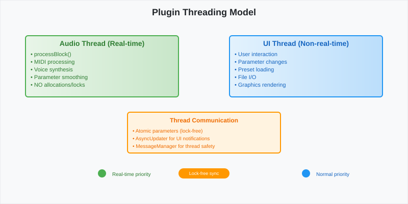
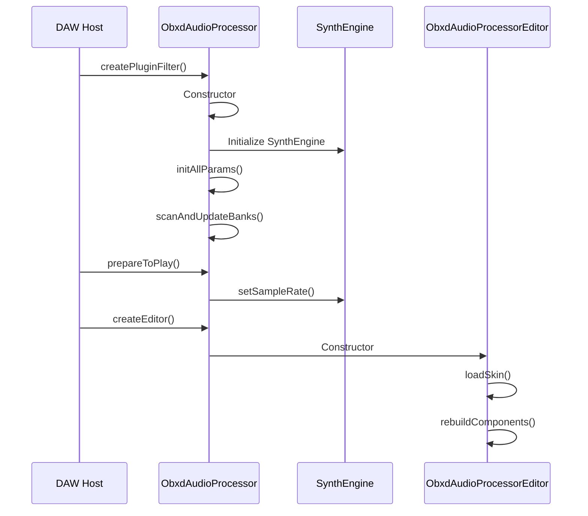

# Plugin Lifecycle Documentation

This document describes

*Threading model shows the separation between the message thread (GUI) and audio thread (DSP processing) with lock-free communication.*ice Management Architecture](diagrams/voice-management-architecture.svg)

*Voice management architecture demonstrates how polyphonic voices are allocated, managed, and released during synthesis.*ugin Preparation Phase](diagrams/plugin-preparation-phase.svg)

*The plugin preparation phase shows the sequence of initialization calls from the host to the plugin, including constructor, prepareToPlay(), parameter setup, and GUI creation.*he complete lifecycle of the OB-Xd audio plugin, from initialization through audio processing to cleanup.

## Overview

The OB-Xd plugin follows the standard JUCE audio plugin architecture with specific implementations for synthesizer functionality. The lifecycle consists of several distinct phases that manage resources, audio processing, and user interaction.

## Lifecycle Phases

### 1. Plugin Loading and Initialization



#### Key Components Initialized:

- **ObxdAudioProcessor**: Main plugin class inheriting from `juce::AudioProcessor`
- **SynthEngine**: Core synthesis engine managing voice allocation and DSP
- **Motherboard**: Voice management and polyphonic processing
- **AudioProcessorValueTreeState**: Parameter management and host automation
- **ObxdBank**: Preset and bank management system

#### Initialization Sequence:

1. **Constructor Phase**:
   ```cpp
   ObxdAudioProcessor::ObxdAudioProcessor()
       : apvtState(*this, &undoManager, "Parameters", createParameterLayout())
   {
       initAllParams();
       initMidi();
       scanAndUpdateBanks();
   }
   ```

2. **Parameter Setup**: Creates 90+ parameters for complete synthesizer control
3. **File System Setup**: Scans for preset banks and skins in user directories
4. **MIDI Initialization**: Sets up MIDI learn capabilities and control mappings

### 2. Preparation Phase

```svg
<svg width="800" height="400" xmlns="http://www.w3.org/2000/svg">
  <defs>
    <marker id="arrowhead" markerWidth="10" markerHeight="7" refX="10" refY="3.5" orient="auto">
      <polygon points="0 0, 10 3.5, 0 7" fill="#333"/>
    </marker>
  </defs>
  
  <!-- Background -->
  <rect width="800" height="400" fill="#f8f9fa" stroke="#dee2e6" stroke-width="1"/>
  
  <!-- Title -->
  <text x="400" y="30" font-family="Arial, sans-serif" font-size="18" font-weight="bold" text-anchor="middle" fill="#212529">Plugin Preparation Phase</text>
  
  <!-- Host box -->
  <rect x="50" y="80" width="120" height="60" fill="#e3f2fd" stroke="#1976d2" stroke-width="2" rx="5"/>
  <text x="110" y="105" font-family="Arial, sans-serif" font-size="12" text-anchor="middle" fill="#1976d2">DAW Host</text>
  <text x="110" y="120" font-family="Arial, sans-serif" font-size="10" text-anchor="middle" fill="#1976d2">prepareToPlay()</text>
  
  <!-- Plugin box -->
  <rect x="250" y="80" width="120" height="60" fill="#fff3e0" stroke="#f57c00" stroke-width="2" rx="5"/>
  <text x="310" y="105" font-family="Arial, sans-serif" font-size="12" text-anchor="middle" fill="#f57c00">Plugin</text>
  <text x="310" y="120" font-family="Arial, sans-serif" font-size="10" text-anchor="middle" fill="#f57c00">ObxdAudioProcessor</text>
  
  <!-- Engine box -->
  <rect x="450" y="80" width="120" height="60" fill="#f3e5f5" stroke="#7b1fa2" stroke-width="2" rx="5"/>
  <text x="510" y="105" font-family="Arial, sans-serif" font-size="12" text-anchor="middle" fill="#7b1fa2">Synth Engine</text>
  <text x="510" y="120" font-family="Arial, sans-serif" font-size="10" text-anchor="middle" fill="#7b1fa2">setSampleRate()</text>
  
  <!-- Voices box -->
  <rect x="630" y="80" width="120" height="60" fill="#e8f5e8" stroke="#388e3c" stroke-width="2" rx="5"/>
  <text x="690" y="105" font-family="Arial, sans-serif" font-size="12" text-anchor="middle" fill="#388e3c">Voice Pool</text>
  <text x="690" y="120" font-family="Arial, sans-serif" font-size="10" text-anchor="middle" fill="#388e3c">32 Voices</text>
  
  <!-- Arrows -->
  <line x1="170" y1="110" x2="250" y2="110" stroke="#333" stroke-width="2" marker-end="url(#arrowhead)"/>
  <line x1="370" y1="110" x2="450" y2="110" stroke="#333" stroke-width="2" marker-end="url(#arrowhead)"/>
  <line x1="570" y1="110" x2="630" y2="110" stroke="#333" stroke-width="2" marker-end="url(#arrowhead)"/>
  
  <!-- Process steps -->
  <rect x="50" y="200" width="700" height="150" fill="#ffffff" stroke="#dee2e6" stroke-width="1" rx="5"/>
  <text x="60" y="220" font-family="Arial, sans-serif" font-size="14" font-weight="bold" fill="#212529">Preparation Steps:</text>
  
  <text x="70" y="245" font-family="Arial, sans-serif" font-size="12" fill="#495057">1. Sample Rate Configuration (44.1kHz - 192kHz)</text>
  <text x="70" y="265" font-family="Arial, sans-serif" font-size="12" fill="#495057">2. Buffer Size Setup (64 - 4096 samples)</text>
  <text x="70" y="285" font-family="Arial, sans-serif" font-size="12" fill="#495057">3. Voice Initialization (up to 32 polyphonic voices)</text>
  <text x="70" y="305" font-family="Arial, sans-serif" font-size="12" fill="#495057">4. Filter Coefficient Calculation</text>
  <text x="70" y="325" font-family="Arial, sans-serif" font-size="12" fill="#495057">5. LFO and Envelope Setup</text>
</svg>
```

During the preparation phase:

1. **Sample Rate Configuration**: All DSP components adapt to the host's sample rate
2. **Voice Pool Setup**: Initialize 32 voice objects with their oscillators, filters, and envelopes
3. **Memory Allocation**: Reserve audio buffers and delay lines
4. **Parameter Smoothing**: Initialize parameter smoothing for real-time changes

### 3. Audio Processing Loop

The heart of the plugin is the `processBlock()` method, which handles real-time audio generation:

```cpp
void ObxdAudioProcessor::processBlock(AudioSampleBuffer& buffer, MidiBuffer& midiMessages)
{
    const int numSamples = buffer.getNumSamples();
    
    // Process MIDI events
    MidiBuffer::Iterator midiIterator(midiMessages);
    midiIterator.setNextSamplePosition(0);
    
    for (int sampleIndex = 0; sampleIndex < numSamples; ++sampleIndex)
    {
        // Process MIDI events for this sample
        processMidiPerSample(&midiIterator, sampleIndex);
        
        // Generate audio sample
        float leftSample = 0.0f, rightSample = 0.0f;
        synth.processSample(&leftSample, &rightSample);
        
        // Write to output buffer
        buffer.setSample(0, sampleIndex, leftSample);
        buffer.setSample(1, sampleIndex, rightSample);
    }
}
```

### 4. Voice Management System

```svg
<svg width="800" height="500" xmlns="http://www.w3.org/2000/svg">
  <defs>
    <marker id="arrowhead" markerWidth="10" markerHeight="7" refX="10" refY="3.5" orient="auto">
      <polygon points="0 0, 10 3.5, 0 7" fill="#333"/>
    </marker>
  </defs>
  
  <!-- Background -->
  <rect width="800" height="500" fill="#f8f9fa" stroke="#dee2e6" stroke-width="1"/>
  
  <!-- Title -->
  <text x="400" y="30" font-family="Arial, sans-serif" font-size="18" font-weight="bold" text-anchor="middle" fill="#212529">Voice Management Architecture</text>
  
  <!-- MIDI Input -->
  <rect x="50" y="80" width="100" height="50" fill="#ffebee" stroke="#c62828" stroke-width="2" rx="5"/>
  <text x="100" y="100" font-family="Arial, sans-serif" font-size="12" text-anchor="middle" fill="#c62828">MIDI</text>
  <text x="100" y="115" font-family="Arial, sans-serif" font-size="10" text-anchor="middle" fill="#c62828">Note On/Off</text>
  
  <!-- Voice Queue -->
  <rect x="200" y="60" width="120" height="90" fill="#e8eaf6" stroke="#3f51b5" stroke-width="2" rx="5"/>
  <text x="260" y="85" font-family="Arial, sans-serif" font-size="12" text-anchor="middle" fill="#3f51b5">Voice Queue</text>
  <text x="260" y="100" font-family="Arial, sans-serif" font-size="10" text-anchor="middle" fill="#3f51b5">Round Robin</text>
  <text x="260" y="115" font-family="Arial, sans-serif" font-size="10" text-anchor="middle" fill="#3f51b5">Voice Stealing</text>
  <text x="260" y="130" font-family="Arial, sans-serif" font-size="10" text-anchor="middle" fill="#3f51b5">Unison Mode</text>
  
  <!-- Motherboard -->
  <rect x="370" y="60" width="120" height="90" fill="#fff8e1" stroke="#ff8f00" stroke-width="2" rx="5"/>
  <text x="430" y="85" font-family="Arial, sans-serif" font-size="12" text-anchor="middle" fill="#ff8f00">Motherboard</text>
  <text x="430" y="100" font-family="Arial, sans-serif" font-size="10" text-anchor="middle" fill="#ff8f00">32 Voice Pool</text>
  <text x="430" y="115" font-family="Arial, sans-serif" font-size="10" text-anchor="middle" fill="#ff8f00">LFO Global</text>
  <text x="430" y="130" font-family="Arial, sans-serif" font-size="10" text-anchor="middle" fill="#ff8f00">Vibrato</text>
  
  <!-- Individual Voices -->
  <g id="voices">
    <rect x="550" y="80" width="80" height="60" fill="#e0f2f1" stroke="#00695c" stroke-width="1" rx="3"/>
    <text x="590" y="100" font-family="Arial, sans-serif" font-size="10" text-anchor="middle" fill="#00695c">Voice 1</text>
    <text x="590" y="115" font-family="Arial, sans-serif" font-size="8" text-anchor="middle" fill="#00695c">Active</text>
    <text x="590" y="130" font-family="Arial, sans-serif" font-size="8" text-anchor="middle" fill="#00695c">Note: C4</text>
    
    <rect x="650" y="80" width="80" height="60" fill="#f3e5f5" stroke="#4a148c" stroke-width="1" rx="3"/>
    <text x="690" y="100" font-family="Arial, sans-serif" font-size="10" text-anchor="middle" fill="#4a148c">Voice 2</text>
    <text x="690" y="115" font-family="Arial, sans-serif" font-size="8" text-anchor="middle" fill="#4a148c">Release</text>
    <text x="690" y="130" font-family="Arial, sans-serif" font-size="8" text-anchor="middle" fill="#4a148c">Note: E4</text>
    
    <!-- Dots indicating more voices -->
    <circle cx="620" cy="170" r="2" fill="#666"/>
    <circle cx="630" cy="170" r="2" fill="#666"/>
    <circle cx="640" cy="170" r="2" fill="#666"/>
    <text x="630" y="185" font-family="Arial, sans-serif" font-size="8" text-anchor="middle" fill="#666">... up to 32 voices</text>
  </g>
  
  <!-- Arrows -->
  <line x1="150" y1="105" x2="200" y2="105" stroke="#333" stroke-width="2" marker-end="url(#arrowhead)"/>
  <line x1="320" y1="105" x2="370" y2="105" stroke="#333" stroke-width="2" marker-end="url(#arrowhead)"/>
  <line x1="490" y1="105" x2="550" y2="105" stroke="#333" stroke-width="2" marker-end="url(#arrowhead)"/>
  
  <!-- Voice States -->
  <rect x="50" y="220" width="700" height="250" fill="#ffffff" stroke="#dee2e6" stroke-width="1" rx="5"/>
  <text x="60" y="245" font-family="Arial, sans-serif" font-size="14" font-weight="bold" fill="#212529">Voice States and Allocation:</text>
  
  <!-- State diagram -->
  <circle cx="150" cy="290" r="30" fill="#e8f5e8" stroke="#2e7d32" stroke-width="2"/>
  <text x="150" y="285" font-family="Arial, sans-serif" font-size="10" text-anchor="middle" fill="#2e7d32">IDLE</text>
  <text x="150" y="300" font-family="Arial, sans-serif" font-size="8" text-anchor="middle" fill="#2e7d32">Available</text>
  
  <circle cx="300" cy="290" r="30" fill="#fff3e0" stroke="#f57c00" stroke-width="2"/>
  <text x="300" y="285" font-family="Arial, sans-serif" font-size="10" text-anchor="middle" fill="#f57c00">ATTACK</text>
  <text x="300" y="300" font-family="Arial, sans-serif" font-size="8" text-anchor="middle" fill="#f57c00">Starting</text>
  
  <circle cx="450" cy="290" r="30" fill="#e3f2fd" stroke="#1976d2" stroke-width="2"/>
  <text x="450" y="285" font-family="Arial, sans-serif" font-size="10" text-anchor="middle" fill="#1976d2">SUSTAIN</text>
  <text x="450" y="300" font-family="Arial, sans-serif" font-size="8" text-anchor="middle" fill="#1976d2">Playing</text>
  
  <circle cx="600" cy="290" r="30" fill="#ffebee" stroke="#c62828" stroke-width="2"/>
  <text x="600" y="285" font-family="Arial, sans-serif" font-size="10" text-anchor="middle" fill="#c62828">RELEASE</text>
  <text x="600" y="300" font-family="Arial, sans-serif" font-size="8" text-anchor="middle" fill="#c62828">Fading</text>
  
  <!-- State transitions -->
  <line x1="180" y1="290" x2="270" y2="290" stroke="#333" stroke-width="2" marker-end="url(#arrowhead)"/>
  <text x="225" y="280" font-family="Arial, sans-serif" font-size="8" text-anchor="middle" fill="#333">Note On</text>
  
  <line x1="330" y1="290" x2="420" y2="290" stroke="#333" stroke-width="2" marker-end="url(#arrowhead)"/>
  <text x="375" y="280" font-family="Arial, sans-serif" font-size="8" text-anchor="middle" fill="#333">Env Peak</text>
  
  <line x1="480" y1="290" x2="570" y2="290" stroke="#333" stroke-width="2" marker-end="url(#arrowhead)"/>
  <text x="525" y="280" font-family="Arial, sans-serif" font-size="8" text-anchor="middle" fill="#333">Note Off</text>
  
  <path d="M 600,320 Q 375,350 150,320" fill="none" stroke="#333" stroke-width="2" marker-end="url(#arrowhead)"/>
  <text x="375" y="365" font-family="Arial, sans-serif" font-size="8" text-anchor="middle" fill="#333">Envelope Complete</text>
  
  <!-- Algorithm descriptions -->
  <text x="70" y="390" font-family="Arial, sans-serif" font-size="12" fill="#495057">Voice Allocation Algorithms:</text>
  <text x="90" y="410" font-family="Arial, sans-serif" font-size="10" fill="#495057">• Round Robin: Cycles through voices sequentially</text>
  <text x="90" y="425" font-family="Arial, sans-serif" font-size="10" fill="#495057">• Voice Stealing: Replaces oldest playing voice when pool exhausted</text>
  <text x="90" y="440" font-family="Arial, sans-serif" font-size="10" fill="#495057">• Unison Mode: All voices play same note with detuning</text>
  <text x="90" y="455" font-family="Arial, sans-serif" font-size="10" fill="#495057">• Economy Mode: Voices pause processing when envelope inactive</text>
</svg>
```

### 5. Parameter Management

The plugin uses JUCE's `AudioProcessorValueTreeState` for parameter management:

```cpp
// Parameter creation in constructor
AudioProcessorValueTreeState::ParameterLayout createParameterLayout()
{
    std::vector<std::unique_ptr<RangedAudioParameter>> parameters;
    
    // Example parameter creation
    parameters.push_back(std::make_unique<AudioParameterFloat>(
        "cutoff", "Cutoff", 0.0f, 1.0f, 1.0f));
    
    return { parameters.begin(), parameters.end() };
}
```

Parameters are synchronized between:
- **Host automation**
- **UI controls**
- **MIDI learn system**
- **Preset system**

### 6. Threading Model

```svg
<svg width="800" height="400" xmlns="http://www.w3.org/2000/svg">
  <defs>
    <linearGradient id="audioGradient" x1="0%" y1="0%" x2="100%" y2="0%">
      <stop offset="0%" style="stop-color:#e8f5e8;stop-opacity:1" />
      <stop offset="100%" style="stop-color:#c8e6c9;stop-opacity:1" />
    </linearGradient>
    <linearGradient id="uiGradient" x1="0%" y1="0%" x2="100%" y2="0%">
      <stop offset="0%" style="stop-color:#e3f2fd;stop-opacity:1" />
      <stop offset="100%" style="stop-color:#bbdefb;stop-opacity:1" />
    </linearGradient>
  </defs>
  
  <!-- Background -->
  <rect width="800" height="400" fill="#f8f9fa" stroke="#dee2e6" stroke-width="1"/>
  
  <!-- Title -->
  <text x="400" y="30" font-family="Arial, sans-serif" font-size="18" font-weight="bold" text-anchor="middle" fill="#212529">Plugin Threading Model</text>
  
  <!-- Audio Thread -->
  <rect x="50" y="70" width="300" height="120" fill="url(#audioGradient)" stroke="#4caf50" stroke-width="2" rx="5"/>
  <text x="200" y="90" font-family="Arial, sans-serif" font-size="14" font-weight="bold" text-anchor="middle" fill="#2e7d32">Audio Thread (Real-time)</text>
  <text x="60" y="110" font-family="Arial, sans-serif" font-size="11" fill="#2e7d32">• processBlock()</text>
  <text x="60" y="125" font-family="Arial, sans-serif" font-size="11" fill="#2e7d32">• MIDI processing</text>
  <text x="60" y="140" font-family="Arial, sans-serif" font-size="11" fill="#2e7d32">• Voice synthesis</text>
  <text x="60" y="155" font-family="Arial, sans-serif" font-size="11" fill="#2e7d32">• Parameter smoothing</text>
  <text x="60" y="170" font-family="Arial, sans-serif" font-size="11" fill="#2e7d32">• NO allocations/locks</text>
  
  <!-- UI Thread -->
  <rect x="450" y="70" width="300" height="120" fill="url(#uiGradient)" stroke="#2196f3" stroke-width="2" rx="5"/>
  <text x="600" y="90" font-family="Arial, sans-serif" font-size="14" font-weight="bold" text-anchor="middle" fill="#1565c0">UI Thread (Non-real-time)</text>
  <text x="460" y="110" font-family="Arial, sans-serif" font-size="11" fill="#1565c0">• User interaction</text>
  <text x="460" y="125" font-family="Arial, sans-serif" font-size="11" fill="#1565c0">• Parameter changes</text>
  <text x="460" y="140" font-family="Arial, sans-serif" font-size="11" fill="#1565c0">• Preset loading</text>
  <text x="460" y="155" font-family="Arial, sans-serif" font-size="11" fill="#1565c0">• File I/O</text>
  <text x="460" y="170" font-family="Arial, sans-serif" font-size="11" fill="#1565c0">• Graphics rendering</text>
  
  <!-- Communication -->
  <rect x="250" y="220" width="300" height="80" fill="#fff3e0" stroke="#ff9800" stroke-width="2" rx="5"/>
  <text x="400" y="240" font-family="Arial, sans-serif" font-size="12" font-weight="bold" text-anchor="middle" fill="#ef6c00">Thread Communication</text>
  <text x="260" y="260" font-family="Arial, sans-serif" font-size="10" fill="#ef6c00">• Atomic parameters (lock-free)</text>
  <text x="260" y="275" font-family="Arial, sans-serif" font-size="10" fill="#ef6c00">• AsyncUpdater for UI notifications</text>
  <text x="260" y="290" font-family="Arial, sans-serif" font-size="10" fill="#ef6c00">• MessageManager for delayed actions</text>
  
  <!-- Critical Sections -->
  <rect x="100" y="330" width="600" height="50" fill="#ffebee" stroke="#f44336" stroke-width="1" rx="3"/>
  <text x="400" y="345" font-family="Arial, sans-serif" font-size="11" font-weight="bold" text-anchor="middle" fill="#c62828">Critical: Audio thread must NEVER block</text>
  <text x="400" y="365" font-family="Arial, sans-serif" font-size="10" text-anchor="middle" fill="#c62828">No mutex locks, file I/O, memory allocation, or UI updates in processBlock()</text>
</svg>
```

### 7. Memory Management

- **Voice Pool**: Pre-allocated at initialization
- **Audio Buffers**: JUCE-managed, reused per block
- **Parameter Storage**: Atomic values for thread safety
- **Preset Data**: Managed by ObxdBank class with reference counting

### 8. Plugin Cleanup

```cpp
ObxdAudioProcessor::~ObxdAudioProcessor()
{
    // Automatic cleanup through RAII
    // - Voice destructors called
    // - JUCE components cleaned up
    // - File handles closed
    // - Memory freed
}
```

The plugin lifecycle ensures:
- **Resource Safety**: No memory leaks or dangling pointers
- **Thread Safety**: Proper synchronization between audio and UI threads
- **Real-time Safety**: Audio thread never blocks
- **Host Compatibility**: Follows VST/AU/AAX specifications

## Performance Considerations

1. **Economy Mode**: Voices stop processing when envelopes are inactive
2. **Parameter Smoothing**: Prevents audio artifacts from parameter changes
3. **Efficient Voice Management**: Round-robin allocation minimizes CPU overhead
4. **SIMD Optimization**: Available for filter processing on supported platforms

This architecture ensures stable, efficient operation across all supported plugin formats and host applications.
